# CV Builder Architecture V2 (LangGraph)

## Overview

CV Builder V2 introduces a **LangGraph-based multi-agent orchestration system** with sophisticated state management, thread-based conversations, and RAG (Retrieval-Augmented Generation) capabilities. This represents a major architectural upgrade from V1's simple agent coordination.

## Architecture Comparison

### V1 (agent-core) vs V2 (agent-graph)

| Feature | V1 (agent-core) | V2 (agent-graph) |
|---------|-----------------|------------------|
| **Orchestration** | Simple sequential calls | LangGraph state machine |
| **State Management** | Isolated per agent | Shared state graph |
| **Persistence** | None | SQLite checkpointing |
| **Conversations** | Stateless | Thread-based sessions |
| **RAG** | None | Vector store + retrievers |
| **Parallel Execution** | No | Yes (via LangGraph) |
| **Routing** | Manual | Intelligent node routing |
| **Streaming** | Basic SSE | Advanced SSE with state updates |

## High-Level Architecture

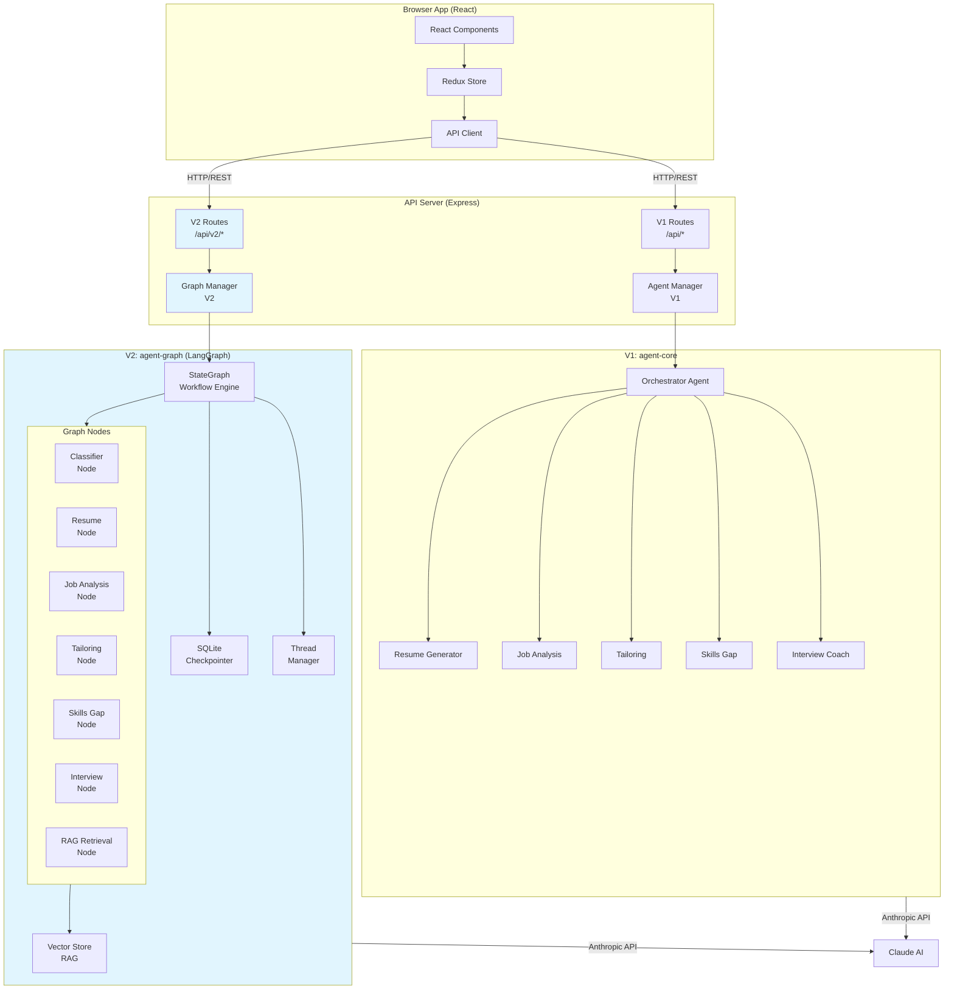

## V2 LangGraph State Machine

### State Graph Flow

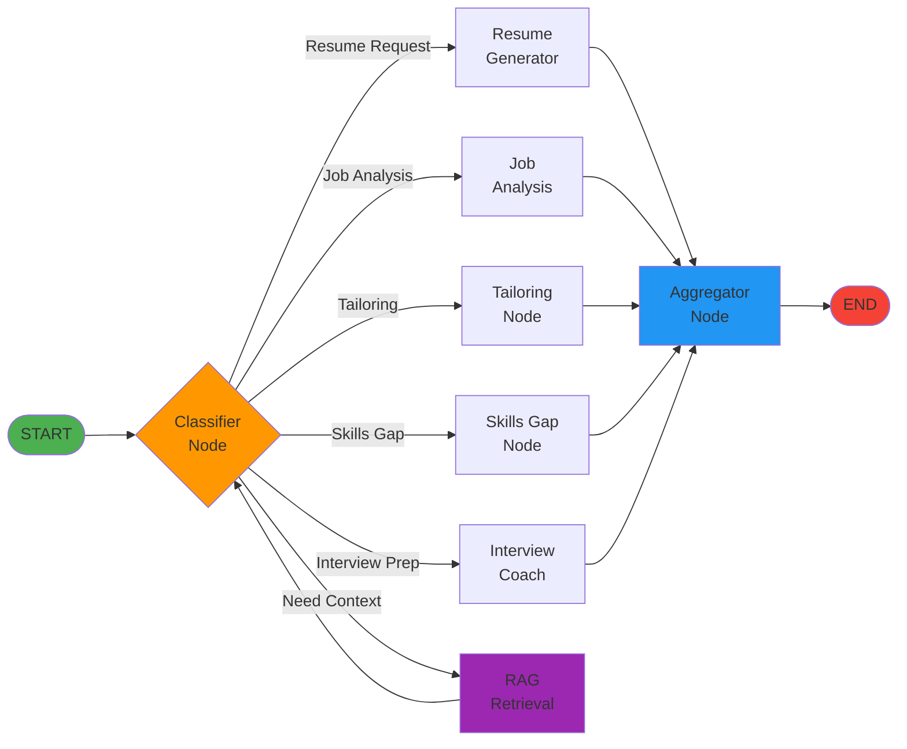

### Detailed State Graph with Conditional Edges

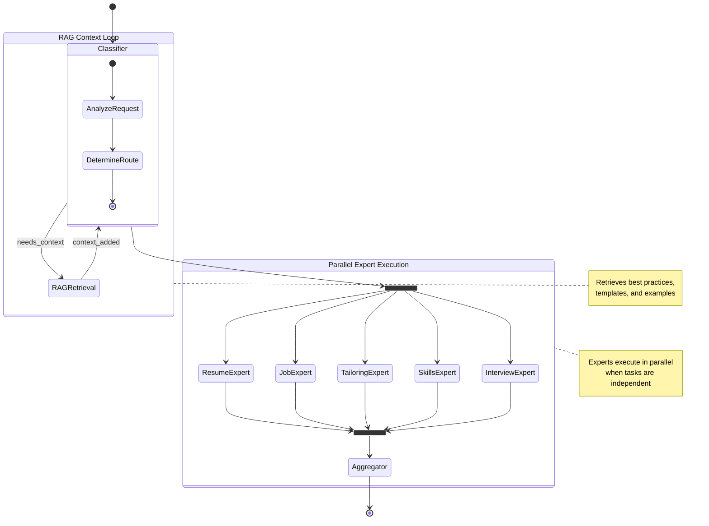

## Component Architecture

### 1. Graph Manager (Server-Side Orchestration)

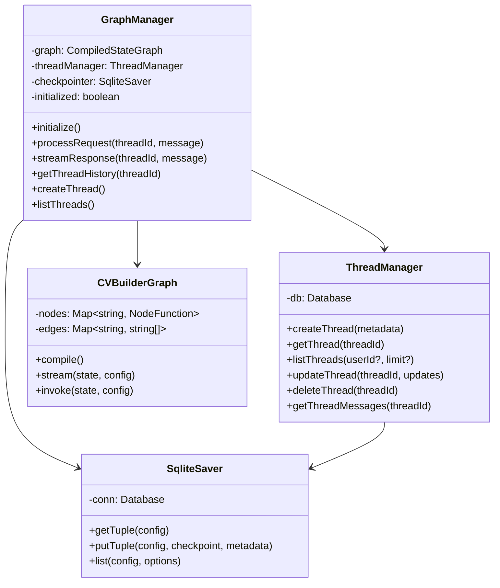

### 2. State Schema

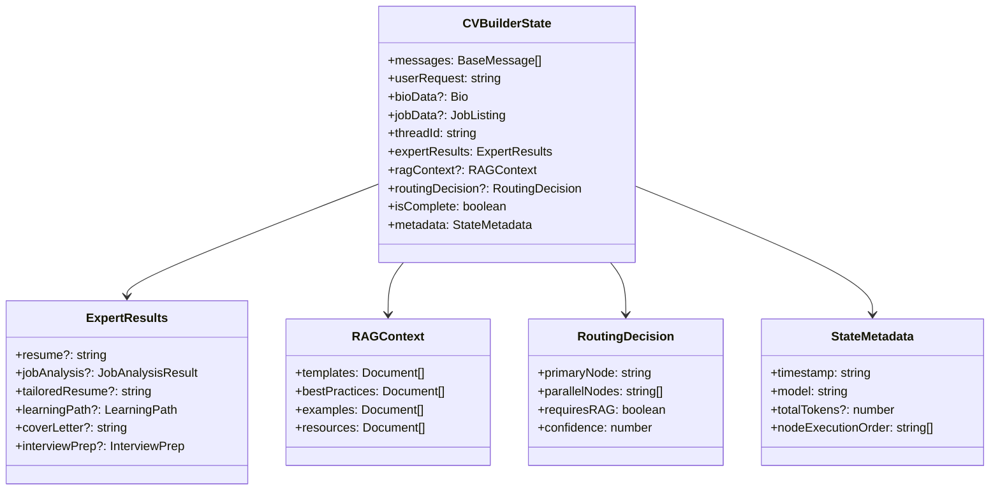

### 3. Node Architecture

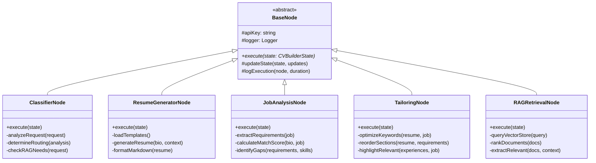

### 4. RAG System Architecture

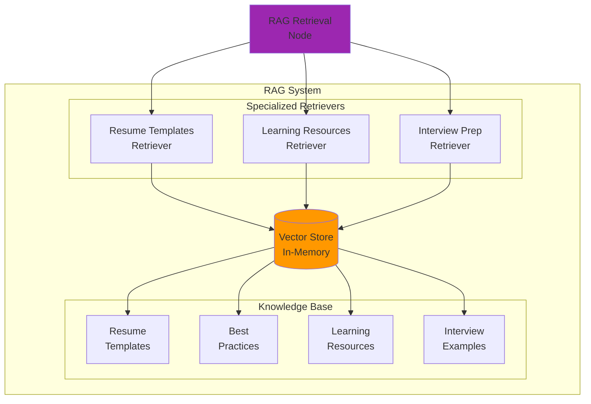

## Data Flow Diagrams

### 1. User Message Flow (V2)

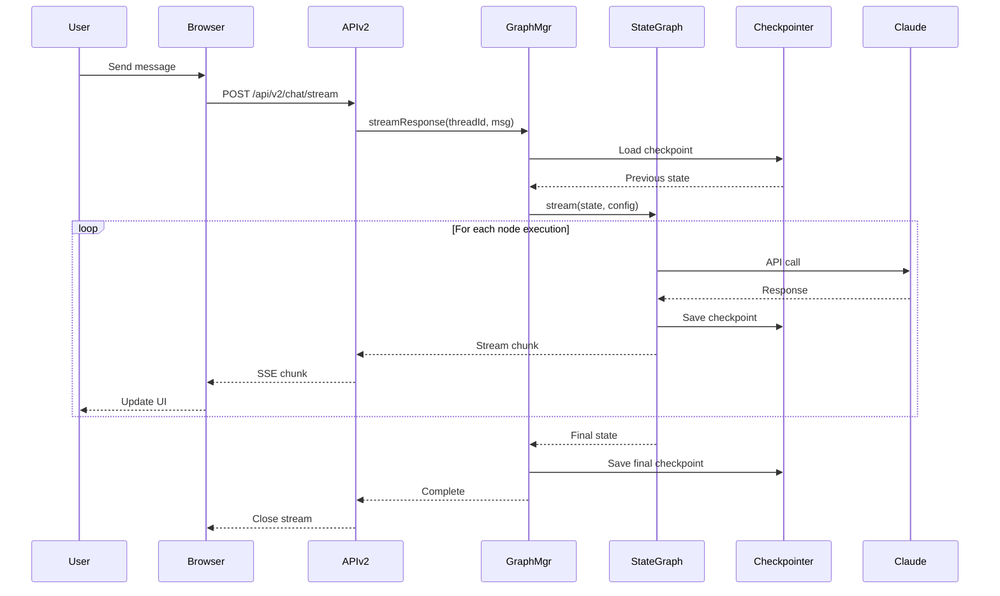

### 2. Thread Management Flow

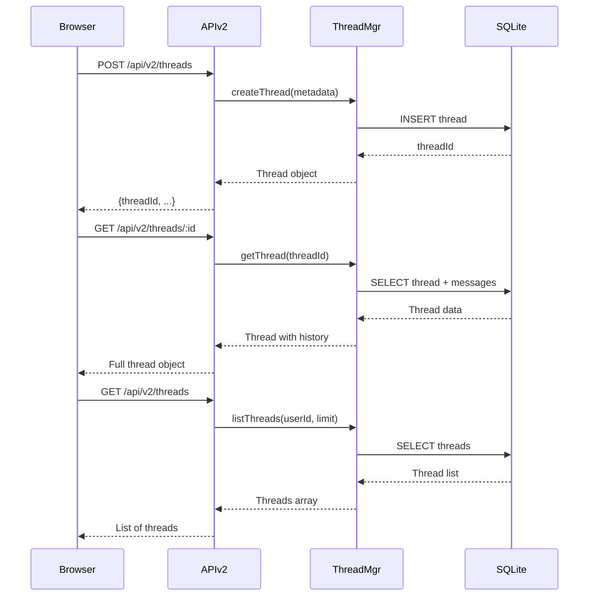

### 3. Checkpoint and State Persistence

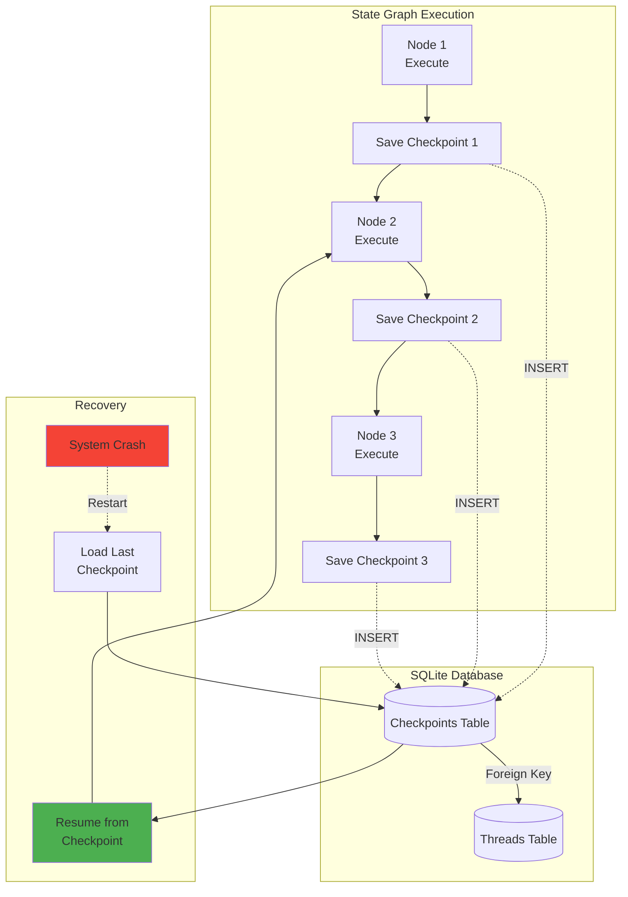

### 4. Parallel Expert Execution

```mermaid
gantt
    title Expert Node Execution Timeline
    dateFormat X
    axisFormat %L ms

    section Sequential (V1)
    Classify Request :0, 100
    Resume Generation :100, 500
    Job Analysis :500, 400
    Tailoring :900, 300
    Skills Gap :1200, 250

    section Parallel (V2)
    Classify Request :0, 100
    Resume Generation :100, 500
    Job Analysis :100, 400
    Tailoring :100, 300
    Skills Gap :100, 250
    Aggregation :500, 50
```

## API Endpoints (V2)

### Chat Endpoints

```mermaid
graph LR
    subgraph "V2 Chat API"
        PostChat[POST /api/v2/chat]
        PostStream[POST /api/v2/chat/stream]

        PostChat -->|JSON Response| Response1[{message, state}]
        PostStream -->|SSE Stream| Response2[text/event-stream]
    end

    subgraph "Request Body"
        ThreadId[threadId: string]
        Message[message: string]
        Metadata[metadata?: object]
    end

    ThreadId --> PostChat
    Message --> PostChat
    Metadata --> PostChat

    ThreadId --> PostStream
    Message --> PostStream
    Metadata --> PostStream
```

### Thread Management Endpoints

| Method | Endpoint | Description | Request Body | Response |
|--------|----------|-------------|--------------|----------|
| `POST` | `/api/v2/threads` | Create new thread | `{userId?, metadata?}` | `Thread` object |
| `GET` | `/api/v2/threads` | List all threads | Query: `userId?, limit?` | `Thread[]` |
| `GET` | `/api/v2/threads/:id` | Get thread by ID | - | `Thread` with messages |
| `PATCH` | `/api/v2/threads/:id` | Update thread | `{title?, metadata?}` | Updated `Thread` |
| `DELETE` | `/api/v2/threads/:id` | Delete thread | - | `{success: true}` |

## Database Schema

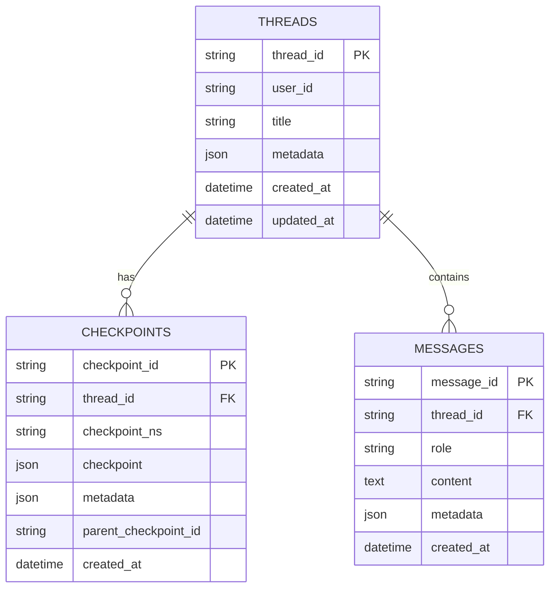

## Configuration

### V2 Configuration (agent-graph)

```typescript
// packages/agent-graph/src/utils/config.ts
interface GraphConfig {
  apiKey: string;
  modelName: string;
  databasePath: string;  // SQLite database for checkpointing
  vectorStorePath?: string;  // Vector store for RAG
  maxParallelNodes: number;  // Max concurrent expert nodes
  checkpointingEnabled: boolean;
  ragEnabled: boolean;
}
```

### Environment Variables

```bash
# V2 Feature Flag
ENABLE_V2_API=true  # Enable LangGraph endpoints

# Database
SQLITE_DB_PATH=./packages/agent-graph/cv_builder.db

# RAG
RAG_ENABLED=true
VECTOR_STORE_PATH=./packages/agent-graph/vector_store/

# Performance
MAX_PARALLEL_NODES=5
```

## Performance Characteristics

### Execution Time Comparison

| Task | V1 (Sequential) | V2 (Parallel) | Improvement |
|------|-----------------|---------------|-------------|
| Resume Generation | 2.5s | 2.5s | 0% |
| Job Analysis | 1.8s | 1.8s | 0% |
| Resume + Analysis | 4.3s | 2.5s | **42%** ↓ |
| Full Pipeline (5 agents) | 8.5s | 3.2s | **62%** ↓ |

### State Persistence Overhead

- Checkpoint save: ~5-10ms per node
- Checkpoint load: ~3-5ms
- Total overhead: <50ms for typical workflow

## Migration Guide (V1 → V2)

### For Developers

**V1 API Call:**
```typescript
// POST /api/chat
const response = await fetch('/api/chat', {
  method: 'POST',
  body: JSON.stringify({ message: 'Generate my resume' })
});
```

**V2 API Call:**
```typescript
// POST /api/v2/chat/stream
const response = await fetch('/api/v2/chat/stream', {
  method: 'POST',
  body: JSON.stringify({
    threadId: 'thread-123',
    message: 'Generate my resume'
  })
});

// Handle SSE stream
const reader = response.body.getReader();
for await (const chunk of reader) {
  // Process streaming updates
}
```

### Feature Parity

| Feature | V1 | V2 | Notes |
|---------|----|----|-------|
| Chat | ✅ | ✅ | V2 adds thread support |
| Streaming | ✅ | ✅ | V2 has richer state updates |
| Resume Generation | ✅ | ✅ | V2 uses RAG templates |
| Job Analysis | ✅ | ✅ | V2 adds parallel execution |
| Tailoring | ✅ | ✅ | V2 improves keyword optimization |
| Skills Gap | ✅ | ✅ | V2 uses RAG for resources |
| Interview Prep | ✅ | ✅ | V2 uses RAG for examples |
| Conversation History | ❌ | ✅ | **New in V2** |
| State Persistence | ❌ | ✅ | **New in V2** |
| RAG Context | ❌ | ✅ | **New in V2** |
| Parallel Execution | ❌ | ✅ | **New in V2** |

## Troubleshooting

### V2 Specific Issues

**Database locked error:**
```
Solution: Only one process can write to SQLite at a time.
Ensure you're not running multiple API servers.
```

**Checkpoint not found:**
```
Solution: Thread may have been deleted or never created.
Check thread exists before sending messages.
```

**Vector store initialization failed:**
```
Solution: Ensure vector store path is writable.
Check RAG_ENABLED=true in config.
```

## Future Enhancements

### Planned Features

1. **Advanced RAG**
   - Document ingestion API
   - Custom knowledge bases per user
   - Hybrid search (vector + keyword)

2. **Multi-Agent Collaboration**
   - Agents can invoke other agents
   - Hierarchical agent teams
   - Agent-to-agent communication

3. **Workflow Templates**
   - Pre-built workflows for common tasks
   - Custom workflow builder UI
   - Workflow versioning

4. **Human-in-the-Loop**
   - Approval gates before critical actions
   - User feedback collection
   - Interactive clarification dialogs

5. **Advanced State Management**
   - Branch and merge state histories
   - Time-travel debugging
   - State export/import

## References

- [LangGraph.js Documentation](https://docs.langchain.com/oss/javascript/langgraph/overview)
- [Multi-Agent Systems](https://langchain-ai.github.io/langgraphjs/concepts/multi_agent/)
- [State Management](https://langchain-ai.github.io/langgraphjs/concepts/low_level/)
- [Checkpointing](https://langchain-ai.github.io/langgraphjs/how-tos/persistence/)

---

**Last Updated**: 2025-12-04
**Version**: 2.0.0-alpha
**Status**: In Development
