# CV Builder Architecture V2 (LangGraph)

> **Status (2026-09-24):** V2 is partly built. **As built** below describes what's in `packages/agent-graph` and `packages/api` today (verified against `main` @ `b670930`, tracking [#154](https://github.com/ojfbot/cv-builder/issues/154)). **Original design** further down is the 2025-12-04 target, kept for reference. Where the two disagree, trust As built.

## As built (2026-09-24)

### Runtime

- The API always mounts V1 (`agent-core`) at `/api/*`. It mounts V2 (`agent-graph`, via `GraphManager`) at `/api/v2/*` only when `ENABLE_V2_API=true`. The root `pnpm dev:*` scripts set the flag. Docker, the CI compose file and `pnpm --filter @resume-builder/api start` don't, so CI's browser suites exercise V1.
- The browser starts in V2 mode (`v2Slice.ts`), and a header toggle switches to V1.
- The public Vercel deployment serves the browser bundle only. Its API base URL is `http://localhost:3001/api`, and no API host is configured.

### State graph

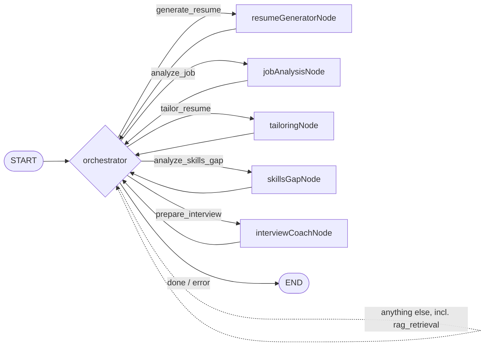
```mermaid
graph LR
    START([START]) --> O{orchestrator}
    O -->|generate_resume| R[resumeGeneratorNode]
    O -->|analyze_job| J[jobAnalysisNode]
    O -->|tailor_resume| T[tailoringNode]
    O -->|analyze_skills_gap| S[skillsGapNode]
    O -->|prepare_interview| I[interviewCoachNode]
    O -->|done / error| END([END])
    O -.->|anything else, incl. rag_retrieval| O
    R --> O
    J --> O
    T --> O
    S --> O
    I --> O
```

- **Routing.** `routeToAgent` (`cv-builder-graph.ts`) switches on `state.nextAction`. The orchestrator sets it by regex-parsing `**Next Action**: <action>` from a model reply, falling back to keyword matching. The parsed value isn't validated against `NextActionSchema`.
- **Hub-and-spoke.** There's no classifier, no parallel fan-out and no aggregator. Each specialist returns to the orchestrator, which makes another model call on the specialist's reply before it can reach `END`.
- **Model settings.** Defaults are `claude-opus-5`, `temperature || 0.7` (so 0 can't be set) and 2048 max tokens for the orchestrator. No explicit `recursionLimit` is passed.
- **Persistence.** The SQLite checkpointer (default, `DB_PATH` or `./cv_builder.db`) or the Postgres one, plus thread managers. `putWrites` is a no-op in both, which blocks `interrupt`-based human-in-the-loop.

### RAG

`src/rag/` holds three retrievers (resume templates, learning resources, interview prep) over an in-memory `MemoryVectorStore` seeded with hard-coded documents, using OpenAI embeddings (`OPENAI_API_KEY`). `createRAGRetrievalNode` is exported but **not added to the graph**. `rag_retrieval` is in the action enum but falls through to the orchestrator, and no node reads `ragResults`.

### API ↔ browser contract

| Endpoint | Server | Browser |
|----------|--------|---------|
| `POST /api/v2/chat` | ✅ | ✅ |
| `POST /api/v2/chat/stream` | ✅ sends `event: connected\|state\|message\|done\|error` frames; `data` has no `type` | ⚠️ `client-v2.ts` only parses segments that start with `data: ` and checks `event.type`. Frames are dropped depending on network chunking, and `done` is never detected |
| `POST/GET/PATCH/DELETE /api/v2/threads[...]`, `GET/PATCH /threads/:id/state`, `GET /threads/user/:userId`, `GET /stats` | ✅ | ✅ |
| `GET /api/v2/threads/:id` | ❌ no route | ⚠️ called by `threadsSlice` (`getThread`) |

### Configuration actually read

| Variable | Used for |
|----------|----------|
| `ENABLE_V2_API` | mount `/api/v2/*` |
| `DATABASE_TYPE` | `sqlite` (default) or `postgres` |
| `DB_PATH` | SQLite file (default `./cv_builder.db`) |
| `DATABASE_URL` / `POSTGRES_URL` | Postgres connection |
| `OPENAI_API_KEY` | RAG embeddings only (RAG is unwired) |
| `LOG_LEVEL` | logger |

The Anthropic key and model come from the agent-core config (`env.json`).

### Tests

`packages/agent-graph` has no test files; vitest is configured but unused. `scripts/test-*.ts` are manual smoke scripts that call the live model.

### Designed, not built

Each row names what would build it. Slices live in [`.claude/roadmap.md`](../.claude/roadmap.md).

| Item | Built by |
|------|----------|
| Input-existence rules, specialist → END on `done\|error`, validated actions, `?? 0.7`, `recursionLimit`, stream-client and `GET /threads/:id` fixes, graph-compile + routing tests | `rm:rm-l1-cv-builder#S1` |
| RAG in the graph with a persistent store and a `ragResults` consumer, or its removal | `rm:rm-l1-cv-builder#S2` |
| Grounding check (every generated bullet maps to a source-CV span) + fabrication eval | `rm:rm-l1-cv-builder#S3` |
| Hosted API reachable from the public site; keyless end-to-end run | `rm:rm-l1-cv-builder#S4`, `#S5` |
| Gap classification, adversarial gap review, pre-submission audit | TD-004 / TD-005 / TD-007 → `rm:rm-l1-cv-builder#S6`–`#S8` |
| Classifier node, parallel expert fan-out, aggregator, `RoutingDecision{confidence}`, RAG loop back to classifier | not scheduled |
| Persisted `putWrites` / human-in-the-loop via `interrupt` | not scheduled |

---

## Original design (2025-12-04) — not as built

> This is the target from 2025-12-04, with headings shifted down a level. It describes components that don't exist (see Designed, not built above). Two sections were removed on 2026-09-24: a V1-vs-V2 performance table that projected speedups for a parallel path that was never built or measured, and a feature-parity table that marked RAG and parallel execution as shipped. The config block and env vars below are the design and aren't read by the code; see Configuration actually read above.

### Architecture Comparison

#### V1 (agent-core) vs V2 (agent-graph)

| Feature | V1 (agent-core) | V2 (agent-graph) |
|---------|-----------------|------------------|
| **Orchestration** | Simple sequential calls | LangGraph state machine |
| **State Management** | Isolated per agent | Shared state graph |
| **Persistence** | None | SQLite checkpointing |
| **Conversations** | Stateless | Thread-based sessions |
| **RAG** | None | Vector store + retrievers |
| **Parallel Execution** | No | Yes (via LangGraph) |
| **Routing** | Manual | Intelligent node routing |
| **Streaming** | Basic SSE | Advanced SSE with state updates |

### High-Level Architecture

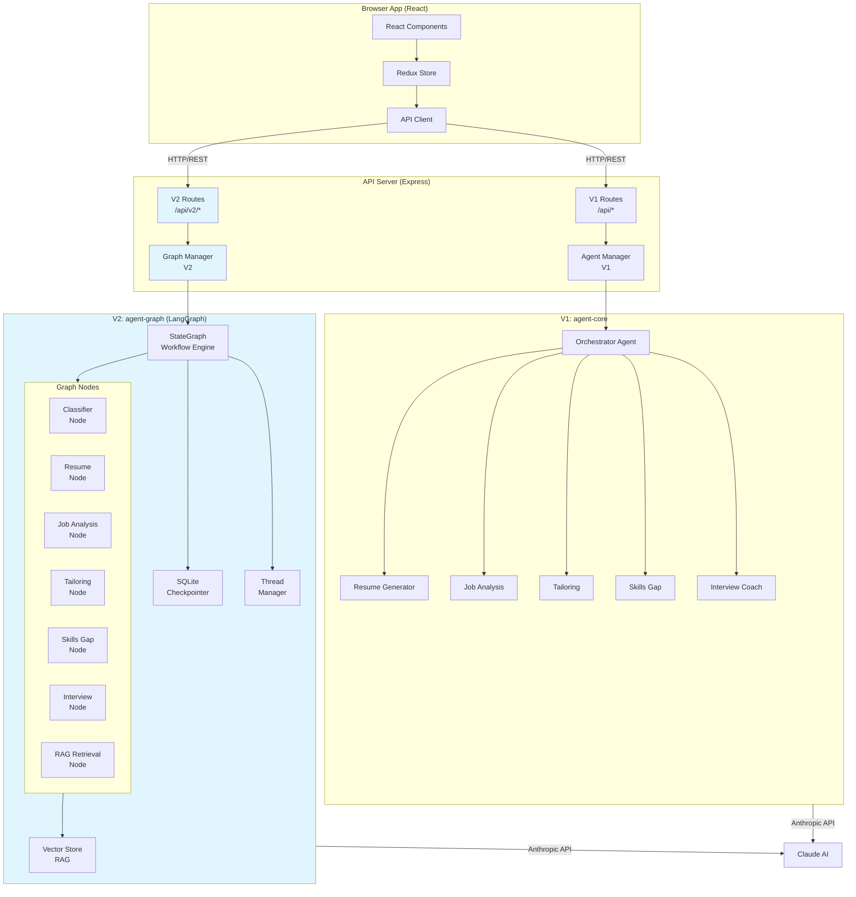
```mermaid
graph TB
    subgraph Browser["Browser App (React)"]
        UI[React Components]
        Redux[Redux Store]
        APIClient[API Client]
        UI --> Redux
        Redux --> APIClient
    end

    subgraph APIServer["API Server (Express)"]
        V1Routes[V1 Routes<br/>/api/*]
        V2Routes[V2 Routes<br/>/api/v2/*]
        AgentMgr[Agent Manager<br/>V1]
        GraphMgr[Graph Manager<br/>V2]

        V1Routes --> AgentMgr
        V2Routes --> GraphMgr
    end

    subgraph V1Core["V1: agent-core"]
        Orchestrator[Orchestrator Agent]
        ResumeGen[Resume Generator]
        JobAnalysis[Job Analysis]
        Tailoring[Tailoring]
        SkillsGap[Skills Gap]
        Interview[Interview Coach]

        AgentMgr --> Orchestrator
        Orchestrator --> ResumeGen
        Orchestrator --> JobAnalysis
        Orchestrator --> Tailoring
        Orchestrator --> SkillsGap
        Orchestrator --> Interview
    end

    subgraph V2Graph["V2: agent-graph (LangGraph)"]
        StateGraph[StateGraph<br/>Workflow Engine]
        Checkpointer[SQLite<br/>Checkpointer]
        ThreadMgr[Thread<br/>Manager]
        VectorStore[Vector Store<br/>RAG]

        subgraph Nodes["Graph Nodes"]
            ClassifierNode[Classifier<br/>Node]
            ResumeNode[Resume<br/>Node]
            JobNode[Job Analysis<br/>Node]
            TailorNode[Tailoring<br/>Node]
            SkillsNode[Skills Gap<br/>Node]
            InterviewNode[Interview<br/>Node]
            RAGNode[RAG Retrieval<br/>Node]
        end

        GraphMgr --> StateGraph
        StateGraph --> Checkpointer
        StateGraph --> ThreadMgr
        StateGraph --> Nodes
        Nodes --> VectorStore
    end

    APIClient -->|HTTP/REST| V1Routes
    APIClient -->|HTTP/REST| V2Routes

    V1Core -->|Anthropic API| Claude[Claude AI]
    V2Graph -->|Anthropic API| Claude

    style V2Graph fill:#e1f5fe
    style V2Routes fill:#e1f5fe
    style GraphMgr fill:#e1f5fe
```

### V2 LangGraph State Machine

#### State Graph Flow

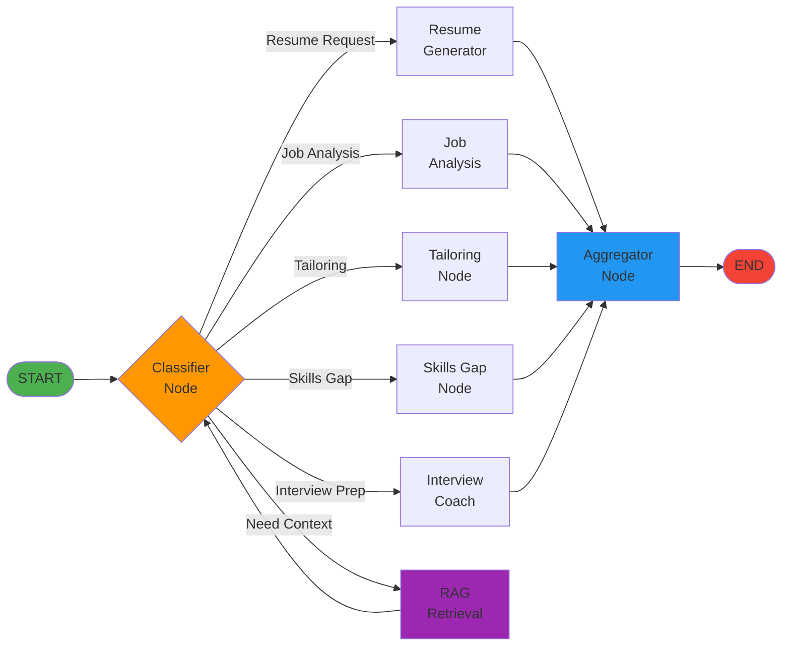
```mermaid
graph LR
    START([START]) --> Classifier{Classifier<br/>Node}

    Classifier -->|Resume Request| ResumeNode[Resume<br/>Generator]
    Classifier -->|Job Analysis| JobNode[Job<br/>Analysis]
    Classifier -->|Tailoring| TailorNode[Tailoring<br/>Node]
    Classifier -->|Skills Gap| SkillsNode[Skills Gap<br/>Node]
    Classifier -->|Interview Prep| InterviewNode[Interview<br/>Coach]
    Classifier -->|Need Context| RAGNode[RAG<br/>Retrieval]

    RAGNode --> Classifier

    ResumeNode --> Aggregator[Aggregator<br/>Node]
    JobNode --> Aggregator
    TailorNode --> Aggregator
    SkillsNode --> Aggregator
    InterviewNode --> Aggregator

    Aggregator --> END([END])

    style START fill:#4caf50
    style END fill:#f44336
    style Classifier fill:#ff9800
    style RAGNode fill:#9c27b0
    style Aggregator fill:#2196f3
```

#### Detailed State Graph with Conditional Edges

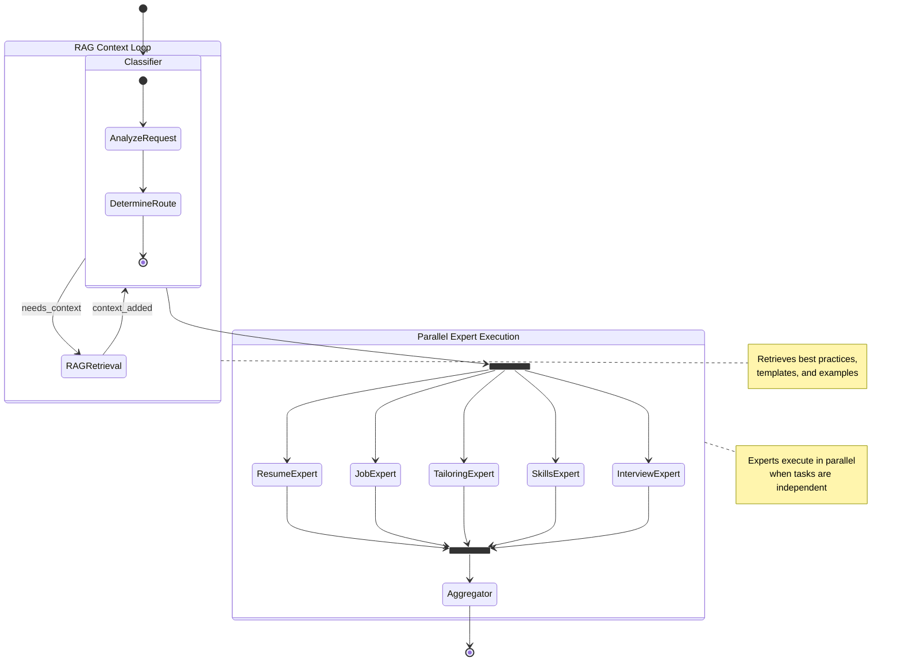
```mermaid
stateDiagram-v2
    [*] --> Classifier

    state Classifier {
        [*] --> AnalyzeRequest
        AnalyzeRequest --> DetermineRoute
        DetermineRoute --> [*]
    }

    state "Parallel Expert Execution" as ParallelExperts {
        state fork_state <<fork>>
        state join_state <<join>>

        Classifier --> fork_state

        fork_state --> ResumeExpert
        fork_state --> JobExpert
        fork_state --> TailoringExpert
        fork_state --> SkillsExpert
        fork_state --> InterviewExpert

        ResumeExpert --> join_state
        JobExpert --> join_state
        TailoringExpert --> join_state
        SkillsExpert --> join_state
        InterviewExpert --> join_state

        join_state --> Aggregator
    }

    state "RAG Context Loop" as RAGLoop {
        Classifier --> RAGRetrieval: needs_context
        RAGRetrieval --> Classifier: context_added
    }

    Aggregator --> [*]

    note right of ParallelExperts
        Experts execute in parallel
        when tasks are independent
    end note

    note right of RAGLoop
        Retrieves best practices,
        templates, and examples
    end note
```

### Component Architecture

#### 1. Graph Manager (Server-Side Orchestration)

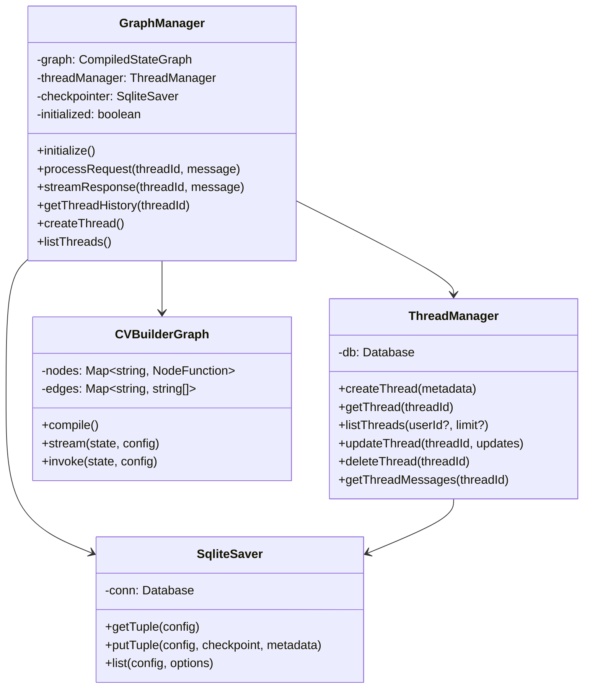
```mermaid
classDiagram
    class GraphManager {
        -graph: CompiledStateGraph
        -threadManager: ThreadManager
        -checkpointer: SqliteSaver
        -initialized: boolean
        +initialize()
        +processRequest(threadId, message)
        +streamResponse(threadId, message)
        +getThreadHistory(threadId)
        +createThread()
        +listThreads()
    }

    class ThreadManager {
        -db: Database
        +createThread(metadata)
        +getThread(threadId)
        +listThreads(userId?, limit?)
        +updateThread(threadId, updates)
        +deleteThread(threadId)
        +getThreadMessages(threadId)
    }

    class SqliteSaver {
        -conn: Database
        +getTuple(config)
        +putTuple(config, checkpoint, metadata)
        +list(config, options)
    }

    class CVBuilderGraph {
        -nodes: Map~string, NodeFunction~
        -edges: Map~string, string[]~
        +compile()
        +stream(state, config)
        +invoke(state, config)
    }

    GraphManager --> ThreadManager
    GraphManager --> SqliteSaver
    GraphManager --> CVBuilderGraph
    ThreadManager --> SqliteSaver
```

#### 2. State Schema

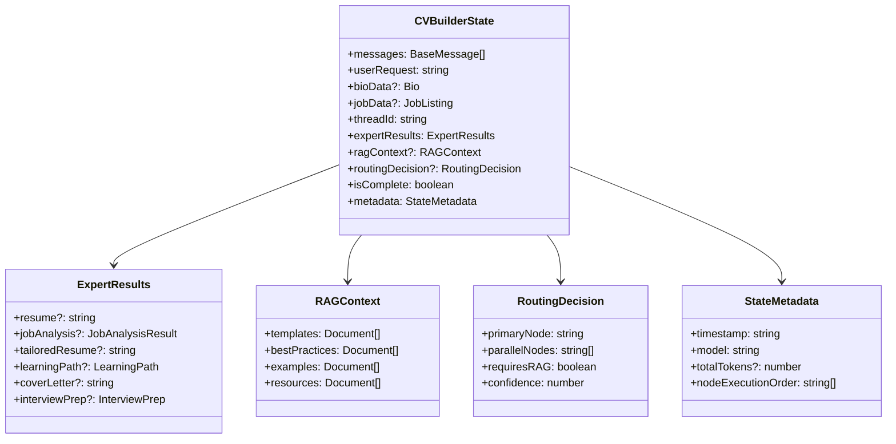
```mermaid
classDiagram
    class CVBuilderState {
        +messages: BaseMessage[]
        +userRequest: string
        +bioData?: Bio
        +jobData?: JobListing
        +threadId: string
        +expertResults: ExpertResults
        +ragContext?: RAGContext
        +routingDecision?: RoutingDecision
        +isComplete: boolean
        +metadata: StateMetadata
    }

    class ExpertResults {
        +resume?: string
        +jobAnalysis?: JobAnalysisResult
        +tailoredResume?: string
        +learningPath?: LearningPath
        +coverLetter?: string
        +interviewPrep?: InterviewPrep
    }

    class RAGContext {
        +templates: Document[]
        +bestPractices: Document[]
        +examples: Document[]
        +resources: Document[]
    }

    class RoutingDecision {
        +primaryNode: string
        +parallelNodes: string[]
        +requiresRAG: boolean
        +confidence: number
    }

    class StateMetadata {
        +timestamp: string
        +model: string
        +totalTokens?: number
        +nodeExecutionOrder: string[]
    }

    CVBuilderState --> ExpertResults
    CVBuilderState --> RAGContext
    CVBuilderState --> RoutingDecision
    CVBuilderState --> StateMetadata
```

#### 3. Node Architecture

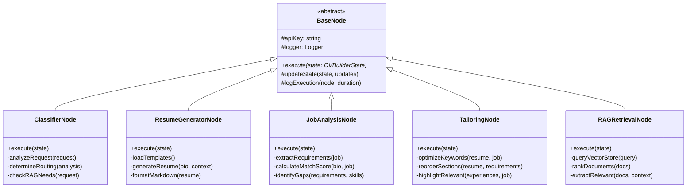
```mermaid
classDiagram
    class BaseNode {
        <<abstract>>
        #apiKey: string
        #logger: Logger
        +execute(state: CVBuilderState)*
        #updateState(state, updates)
        #logExecution(node, duration)
    }

    class ClassifierNode {
        +execute(state)
        -analyzeRequest(request)
        -determineRouting(analysis)
        -checkRAGNeeds(request)
    }

    class ResumeGeneratorNode {
        +execute(state)
        -loadTemplates()
        -generateResume(bio, context)
        -formatMarkdown(resume)
    }

    class JobAnalysisNode {
        +execute(state)
        -extractRequirements(job)
        -calculateMatchScore(bio, job)
        -identifyGaps(requirements, skills)
    }

    class TailoringNode {
        +execute(state)
        -optimizeKeywords(resume, job)
        -reorderSections(resume, requirements)
        -highlightRelevant(experiences, job)
    }

    class RAGRetrievalNode {
        +execute(state)
        -queryVectorStore(query)
        -rankDocuments(docs)
        -extractRelevant(docs, context)
    }

    BaseNode <|-- ClassifierNode
    BaseNode <|-- ResumeGeneratorNode
    BaseNode <|-- JobAnalysisNode
    BaseNode <|-- TailoringNode
    BaseNode <|-- RAGRetrievalNode
```

#### 4. RAG System Architecture

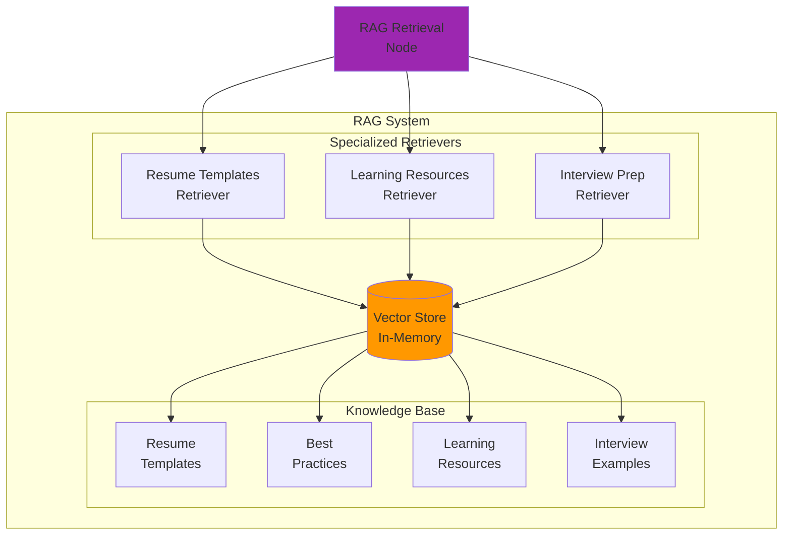
```mermaid
graph TB
    subgraph RAGSystem["RAG System"]
        VectorStore[(Vector Store<br/>In-Memory)]

        subgraph Retrievers["Specialized Retrievers"]
            ResumeRetriever[Resume Templates<br/>Retriever]
            LearningRetriever[Learning Resources<br/>Retriever]
            InterviewRetriever[Interview Prep<br/>Retriever]
        end

        subgraph Knowledge["Knowledge Base"]
            Templates[Resume<br/>Templates]
            BestPractices[Best<br/>Practices]
            Resources[Learning<br/>Resources]
            Examples[Interview<br/>Examples]
        end
    end

    RAGNode[RAG Retrieval<br/>Node] --> ResumeRetriever
    RAGNode --> LearningRetriever
    RAGNode --> InterviewRetriever

    ResumeRetriever --> VectorStore
    LearningRetriever --> VectorStore
    InterviewRetriever --> VectorStore

    VectorStore --> Templates
    VectorStore --> BestPractices
    VectorStore --> Resources
    VectorStore --> Examples

    style RAGNode fill:#9c27b0
    style VectorStore fill:#ff9800
```

### Data Flow Diagrams

#### 1. User Message Flow (V2)

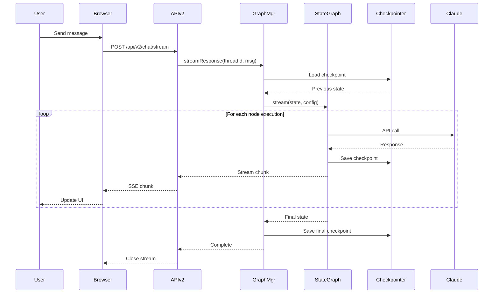
```mermaid
sequenceDiagram
    participant User
    participant Browser
    participant APIv2
    participant GraphMgr
    participant StateGraph
    participant Checkpointer
    participant Claude

    User->>Browser: Send message
    Browser->>APIv2: POST /api/v2/chat/stream
    APIv2->>GraphMgr: streamResponse(threadId, msg)
    GraphMgr->>Checkpointer: Load checkpoint
    Checkpointer-->>GraphMgr: Previous state
    GraphMgr->>StateGraph: stream(state, config)

    loop For each node execution
        StateGraph->>Claude: API call
        Claude-->>StateGraph: Response
        StateGraph->>Checkpointer: Save checkpoint
        StateGraph-->>APIv2: Stream chunk
        APIv2-->>Browser: SSE chunk
        Browser-->>User: Update UI
    end

    StateGraph-->>GraphMgr: Final state
    GraphMgr->>Checkpointer: Save final checkpoint
    GraphMgr-->>APIv2: Complete
    APIv2-->>Browser: Close stream
```

#### 2. Thread Management Flow

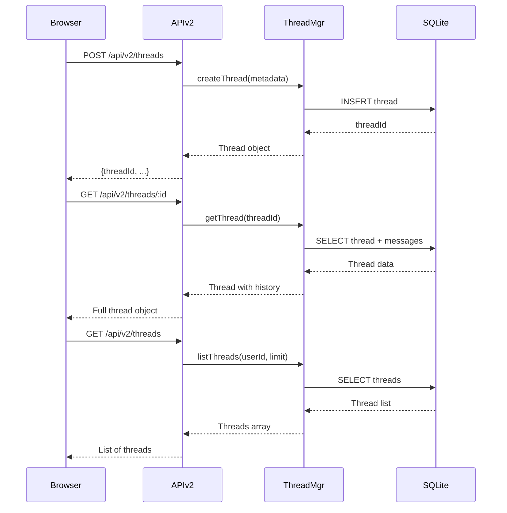
```mermaid
sequenceDiagram
    participant Browser
    participant APIv2
    participant ThreadMgr
    participant SQLite

    Browser->>APIv2: POST /api/v2/threads
    APIv2->>ThreadMgr: createThread(metadata)
    ThreadMgr->>SQLite: INSERT thread
    SQLite-->>ThreadMgr: threadId
    ThreadMgr-->>APIv2: Thread object
    APIv2-->>Browser: {threadId, ...}

    Browser->>APIv2: GET /api/v2/threads/:id
    APIv2->>ThreadMgr: getThread(threadId)
    ThreadMgr->>SQLite: SELECT thread + messages
    SQLite-->>ThreadMgr: Thread data
    ThreadMgr-->>APIv2: Thread with history
    APIv2-->>Browser: Full thread object

    Browser->>APIv2: GET /api/v2/threads
    APIv2->>ThreadMgr: listThreads(userId, limit)
    ThreadMgr->>SQLite: SELECT threads
    SQLite-->>ThreadMgr: Thread list
    ThreadMgr-->>APIv2: Threads array
    APIv2-->>Browser: List of threads
```

#### 3. Checkpoint and State Persistence

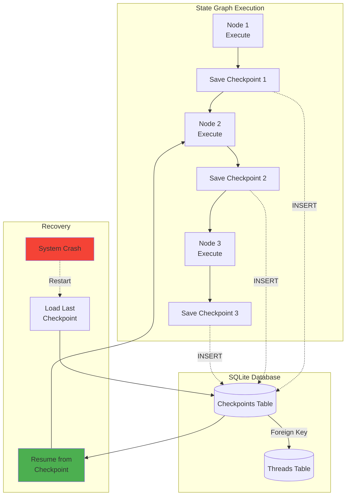
```mermaid
graph TB
    subgraph "State Graph Execution"
        Node1[Node 1<br/>Execute] --> Save1[Save Checkpoint 1]
        Save1 --> Node2[Node 2<br/>Execute]
        Node2 --> Save2[Save Checkpoint 2]
        Save2 --> Node3[Node 3<br/>Execute]
        Node3 --> Save3[Save Checkpoint 3]
    end

    subgraph "SQLite Database"
        CheckpointTable[(Checkpoints Table)]
        ThreadTable[(Threads Table)]

        Save1 -.->|INSERT| CheckpointTable
        Save2 -.->|INSERT| CheckpointTable
        Save3 -.->|INSERT| CheckpointTable

        CheckpointTable -->|Foreign Key| ThreadTable
    end

    subgraph "Recovery"
        Crash[System Crash] -.->|Restart| Load[Load Last<br/>Checkpoint]
        Load --> CheckpointTable
        CheckpointTable --> Resume[Resume from<br/>Checkpoint]
        Resume --> Node2
    end

    style Crash fill:#f44336
    style Resume fill:#4caf50
```

#### 4. Parallel Expert Execution


```mermaid
gantt
    title Expert Node Execution Timeline
    dateFormat X
    axisFormat %L ms

    section Sequential (V1)
    Classify Request :0, 100
    Resume Generation :100, 500
    Job Analysis :500, 400
    Tailoring :900, 300
    Skills Gap :1200, 250

    section Parallel (V2)
    Classify Request :0, 100
    Resume Generation :100, 500
    Job Analysis :100, 400
    Tailoring :100, 300
    Skills Gap :100, 250
    Aggregation :500, 50
```

### API Endpoints (V2)

#### Chat Endpoints

```mermaid
graph LR
    subgraph "V2 Chat API"
        PostChat[POST /api/v2/chat]
        PostStream[POST /api/v2/chat/stream]

        PostChat -->|JSON Response| Response1[{message, state}]
        PostStream -->|SSE Stream| Response2[text/event-stream]
    end

    subgraph "Request Body"
        ThreadId[threadId: string]
        Message[message: string]
        Metadata[metadata?: object]
    end

    ThreadId --> PostChat
    Message --> PostChat
    Metadata --> PostChat

    ThreadId --> PostStream
    Message --> PostStream
    Metadata --> PostStream
```

#### Thread Management Endpoints

| Method | Endpoint | Description | Request Body | Response |
|--------|----------|-------------|--------------|----------|
| `POST` | `/api/v2/threads` | Create new thread | `{userId?, metadata?}` | `Thread` object |
| `GET` | `/api/v2/threads` | List all threads | Query: `userId?, limit?` | `Thread[]` |
| `GET` | `/api/v2/threads/:id` | Get thread by ID | - | `Thread` with messages |
| `PATCH` | `/api/v2/threads/:id` | Update thread | `{title?, metadata?}` | Updated `Thread` |
| `DELETE` | `/api/v2/threads/:id` | Delete thread | - | `{success: true}` |

### Database Schema

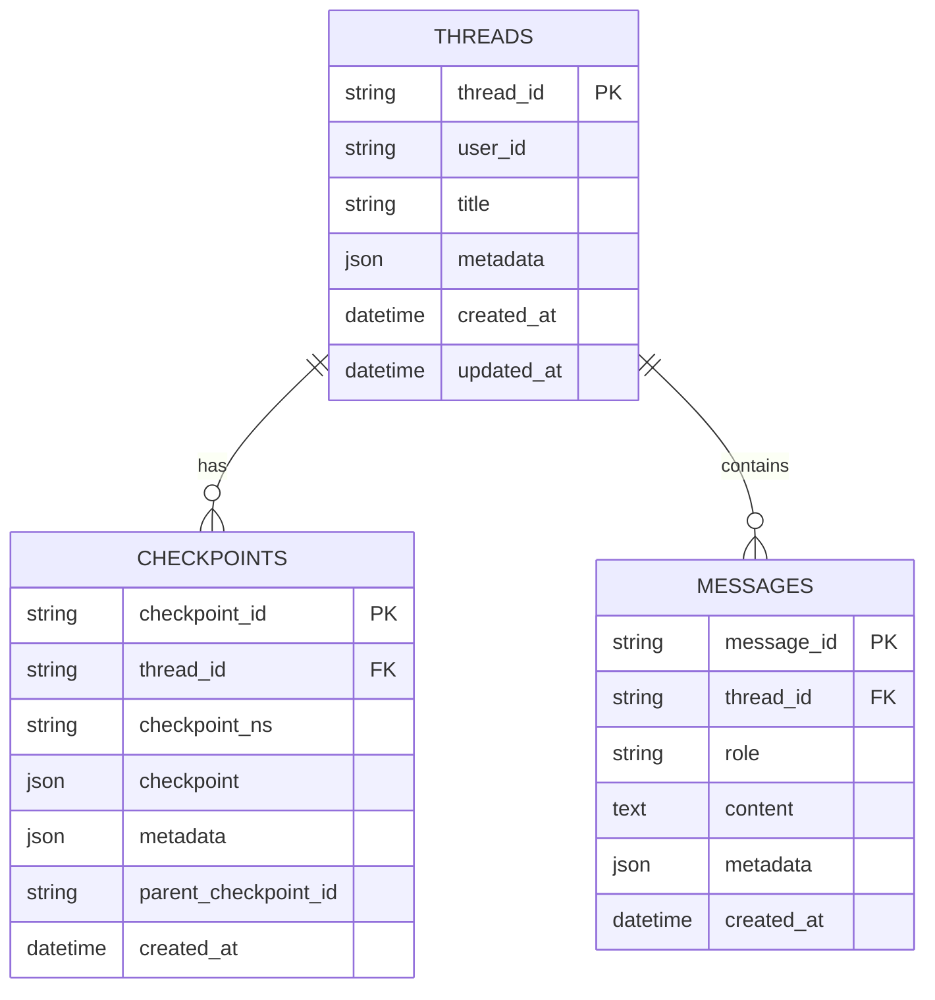
```mermaid
erDiagram
    THREADS ||--o{ CHECKPOINTS : has
    THREADS ||--o{ MESSAGES : contains

    THREADS {
        string thread_id PK
        string user_id
        string title
        json metadata
        datetime created_at
        datetime updated_at
    }

    CHECKPOINTS {
        string checkpoint_id PK
        string thread_id FK
        string checkpoint_ns
        json checkpoint
        json metadata
        string parent_checkpoint_id
        datetime created_at
    }

    MESSAGES {
        string message_id PK
        string thread_id FK
        string role
        text content
        json metadata
        datetime created_at
    }
```

### Configuration

#### V2 Configuration (agent-graph)

```typescript
// packages/agent-graph/src/utils/config.ts
interface GraphConfig {
  apiKey: string;
  modelName: string;
  databasePath: string;  // SQLite database for checkpointing
  vectorStorePath?: string;  // Vector store for RAG
  maxParallelNodes: number;  // Max concurrent expert nodes
  checkpointingEnabled: boolean;
  ragEnabled: boolean;
}
```

#### Environment Variables

```bash
# V2 Feature Flag
ENABLE_V2_API=true  # Enable LangGraph endpoints

# Database
SQLITE_DB_PATH=./packages/agent-graph/cv_builder.db

# RAG
RAG_ENABLED=true
VECTOR_STORE_PATH=./packages/agent-graph/vector_store/

# Performance
MAX_PARALLEL_NODES=5
```

### Migration Guide (V1 → V2)

#### For Developers

**V1 API Call:**
```typescript
// POST /api/chat
const response = await fetch('/api/chat', {
  method: 'POST',
  body: JSON.stringify({ message: 'Generate my resume' })
});
```

**V2 API Call:**
```typescript
// POST /api/v2/chat/stream
const response = await fetch('/api/v2/chat/stream', {
  method: 'POST',
  body: JSON.stringify({
    threadId: 'thread-123',
    message: 'Generate my resume'
  })
});

// Handle SSE stream
const reader = response.body.getReader();
for await (const chunk of reader) {
  // Process streaming updates
}
```

### Troubleshooting

#### V2 Specific Issues

**Database locked error:**
```
Solution: Only one process can write to SQLite at a time.
Ensure you're not running multiple API servers.
```

**Checkpoint not found:**
```
Solution: Thread may have been deleted or never created.
Check thread exists before sending messages.
```

### Future Enhancements

#### Planned Features

1. **Advanced RAG**
   - Document ingestion API
   - Custom knowledge bases per user
   - Hybrid search (vector + keyword)

2. **Multi-Agent Collaboration**
   - Agents can invoke other agents
   - Hierarchical agent teams
   - Agent-to-agent communication

3. **Workflow Templates**
   - Pre-built workflows for common tasks
   - Custom workflow builder UI
   - Workflow versioning

4. **Human-in-the-Loop**
   - Approval gates before critical actions
   - User feedback collection
   - Interactive clarification dialogs

5. **Advanced State Management**
   - Branch and merge state histories
   - Time-travel debugging
   - State export/import

### References

- [LangGraph.js Documentation](https://docs.langchain.com/oss/javascript/langgraph/overview)
- [Multi-Agent Systems](https://langchain-ai.github.io/langgraphjs/concepts/multi_agent/)
- [State Management](https://langchain-ai.github.io/langgraphjs/concepts/low_level/)
- [Checkpointing](https://langchain-ai.github.io/langgraphjs/how-tos/persistence/)

---

**Design written**: 2025-12-04 · **As built verified**: 2026-09-24
