# Service Interactions and Data Flow

This document provides detailed diagrams of how services interact within the CV Builder application, covering both V1 (agent-core) and V2 (agent-graph) architectures.

## Table of Contents

1. [System Overview](#system-overview)
2. [V1 Service Interactions](#v1-service-interactions)
3. [V2 Service Interactions](#v2-service-interactions)
4. [Cross-Service Communication](#cross-service-communication)
5. [State Management](#state-management)
6. [Error Handling](#error-handling)
7. [Security Flows](#security-flows)

## System Overview

### Complete System Architecture

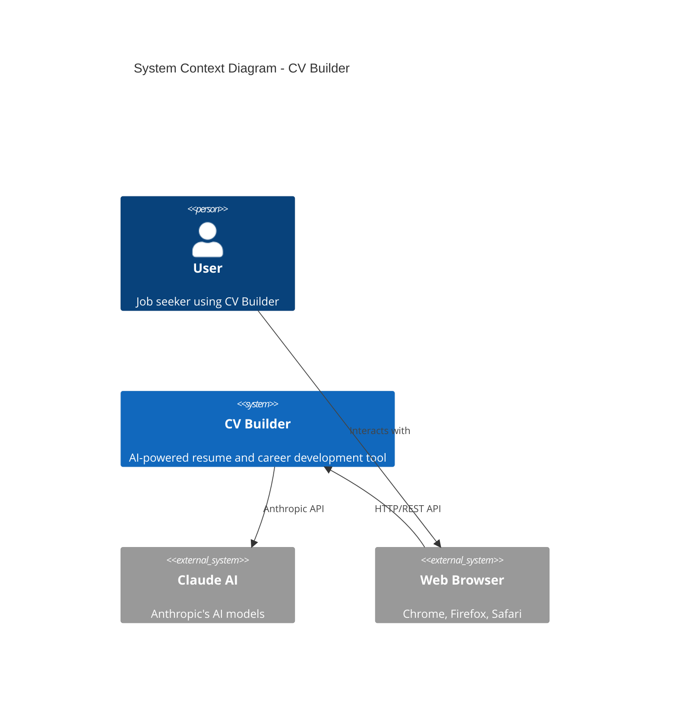
```mermaid
C4Context
    title System Context Diagram - CV Builder

    Person(user, "User", "Job seeker using CV Builder")
    System(cvbuilder, "CV Builder", "AI-powered resume and career development tool")
    System_Ext(claude, "Claude AI", "Anthropic's AI models")
    System_Ext(browser, "Web Browser", "Chrome, Firefox, Safari")

    Rel(user, browser, "Interacts with")
    Rel(browser, cvbuilder, "HTTP/REST API")
    Rel(cvbuilder, claude, "Anthropic API")

    UpdateLayoutConfig($c4ShapeInRow="3", $c4BoundaryInRow="1")
```

### Container Architecture

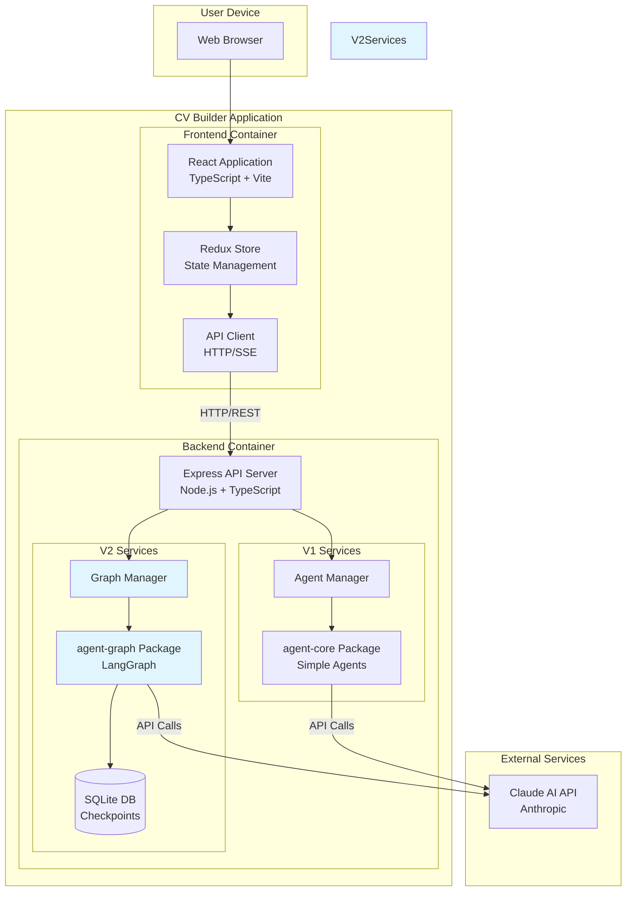
```mermaid
graph TB
    subgraph "User Device"
        Browser[Web Browser]
    end

    subgraph "CV Builder Application"
        subgraph "Frontend Container"
            ReactApp[React Application<br/>TypeScript + Vite]
            Redux[Redux Store<br/>State Management]
            APIClient[API Client<br/>HTTP/SSE]
        end

        subgraph "Backend Container"
            ExpressAPI[Express API Server<br/>Node.js + TypeScript]
            subgraph "V1 Services"
                AgentManager[Agent Manager]
                AgentCore[agent-core Package<br/>Simple Agents]
            end
            subgraph "V2 Services"
                GraphManager[Graph Manager]
                AgentGraph[agent-graph Package<br/>LangGraph]
                SQLite[(SQLite DB<br/>Checkpoints)]
            end
        end
    end

    subgraph "External Services"
        ClaudeAPI[Claude AI API<br/>Anthropic]
    end

    Browser --> ReactApp
    ReactApp --> Redux
    Redux --> APIClient
    APIClient -->|HTTP/REST| ExpressAPI

    ExpressAPI --> AgentManager
    ExpressAPI --> GraphManager

    AgentManager --> AgentCore
    GraphManager --> AgentGraph
    AgentGraph --> SQLite

    AgentCore -->|API Calls| ClaudeAPI
    AgentGraph -->|API Calls| ClaudeAPI

    style V2Services fill:#e1f5fe
    style AgentGraph fill:#e1f5fe
    style GraphManager fill:#e1f5fe
```

## V1 Service Interactions

### V1 Chat Flow

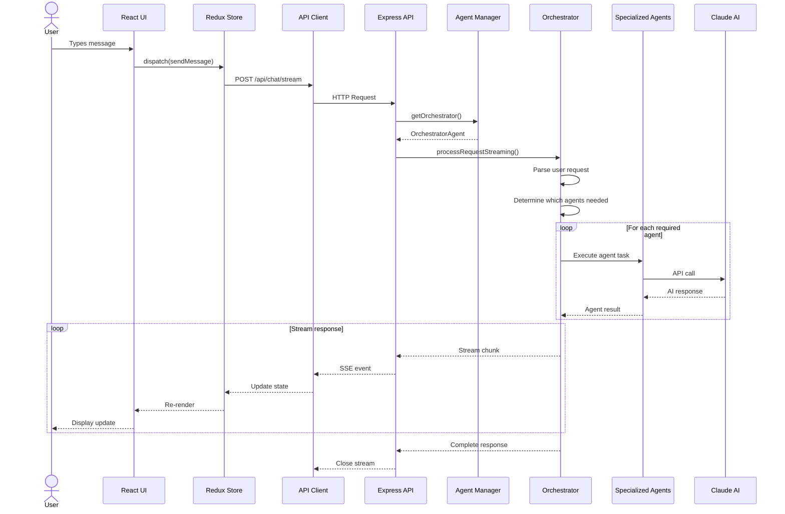
```mermaid
sequenceDiagram
    actor User
    participant UI as React UI
    participant Redux as Redux Store
    participant Client as API Client
    participant API as Express API
    participant Mgr as Agent Manager
    participant Orch as Orchestrator
    participant Agents as Specialized Agents
    participant Claude as Claude AI

    User->>UI: Types message
    UI->>Redux: dispatch(sendMessage)
    Redux->>Client: POST /api/chat/stream

    Client->>API: HTTP Request
    API->>Mgr: getOrchestrator()
    Mgr-->>API: OrchestratorAgent

    API->>Orch: processRequestStreaming()
    Orch->>Orch: Parse user request
    Orch->>Orch: Determine which agents needed

    loop For each required agent
        Orch->>Agents: Execute agent task
        Agents->>Claude: API call
        Claude-->>Agents: AI response
        Agents-->>Orch: Agent result
    end

    loop Stream response
        Orch-->>API: Stream chunk
        API-->>Client: SSE event
        Client-->>Redux: Update state
        Redux-->>UI: Re-render
        UI-->>User: Display update
    end

    Orch-->>API: Complete response
    API-->>Client: Close stream
```

### V1 Resume Generation Flow

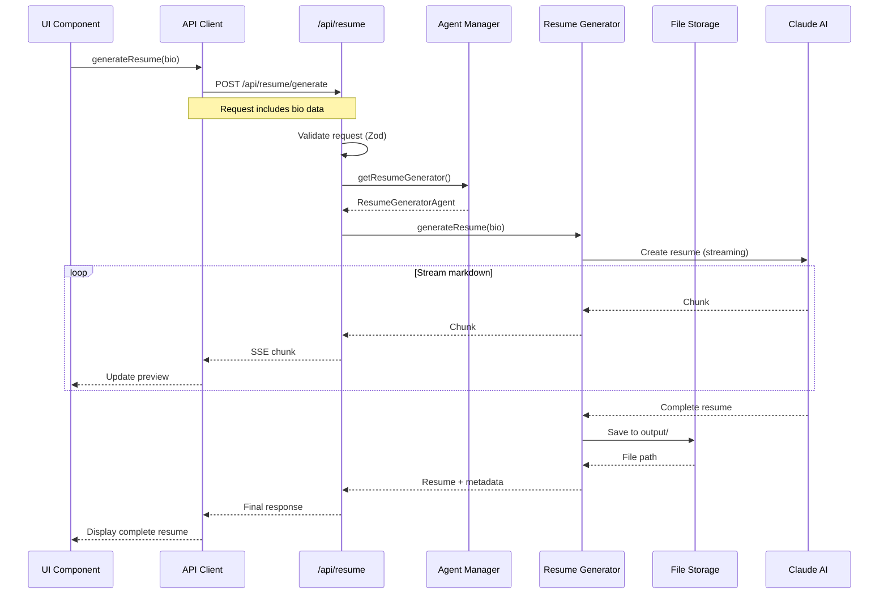
```mermaid
sequenceDiagram
    participant UI as UI Component
    participant Client as API Client
    participant API as /api/resume
    participant Mgr as Agent Manager
    participant ResumeGen as Resume Generator
    participant Storage as File Storage
    participant Claude as Claude AI

    UI->>Client: generateResume(bio)
    Client->>API: POST /api/resume/generate
    Note over Client,API: Request includes bio data

    API->>API: Validate request (Zod)
    API->>Mgr: getResumeGenerator()
    Mgr-->>API: ResumeGeneratorAgent

    API->>ResumeGen: generateResume(bio)
    ResumeGen->>Claude: Create resume (streaming)

    loop Stream markdown
        Claude-->>ResumeGen: Chunk
        ResumeGen-->>API: Chunk
        API-->>Client: SSE chunk
        Client-->>UI: Update preview
    end

    Claude-->>ResumeGen: Complete resume
    ResumeGen->>Storage: Save to output/
    Storage-->>ResumeGen: File path

    ResumeGen-->>API: Resume + metadata
    API-->>Client: Final response
    Client-->>UI: Display complete resume
```

### V1 Job Analysis and Tailoring Flow

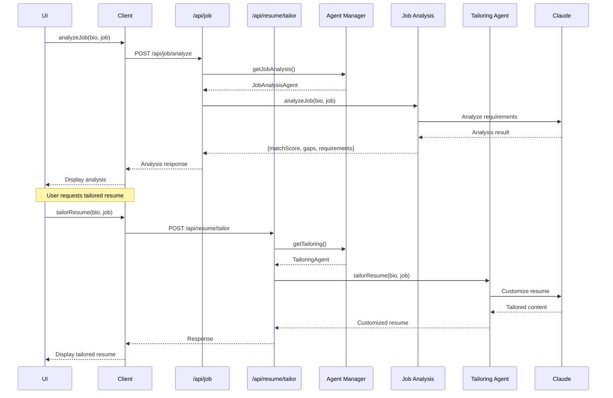
```mermaid
sequenceDiagram
    participant UI
    participant Client
    participant JobAPI as /api/job
    participant TailorAPI as /api/resume/tailor
    participant Mgr as Agent Manager
    participant JobAgent as Job Analysis
    participant TailorAgent as Tailoring Agent
    participant Claude

    UI->>Client: analyzeJob(bio, job)
    Client->>JobAPI: POST /api/job/analyze

    JobAPI->>Mgr: getJobAnalysis()
    Mgr-->>JobAPI: JobAnalysisAgent

    JobAPI->>JobAgent: analyzeJob(bio, job)
    JobAgent->>Claude: Analyze requirements
    Claude-->>JobAgent: Analysis result
    JobAgent-->>JobAPI: {matchScore, gaps, requirements}
    JobAPI-->>Client: Analysis response
    Client-->>UI: Display analysis

    Note over UI,Client: User requests tailored resume

    UI->>Client: tailorResume(bio, job)
    Client->>TailorAPI: POST /api/resume/tailor

    TailorAPI->>Mgr: getTailoring()
    Mgr-->>TailorAPI: TailoringAgent

    TailorAPI->>TailorAgent: tailorResume(bio, job)
    TailorAgent->>Claude: Customize resume
    Claude-->>TailorAgent: Tailored content
    TailorAgent-->>TailorAPI: Customized resume
    TailorAPI-->>Client: Response
    Client-->>UI: Display tailored resume
```

## V2 Service Interactions

### V2 Thread-Based Chat Flow

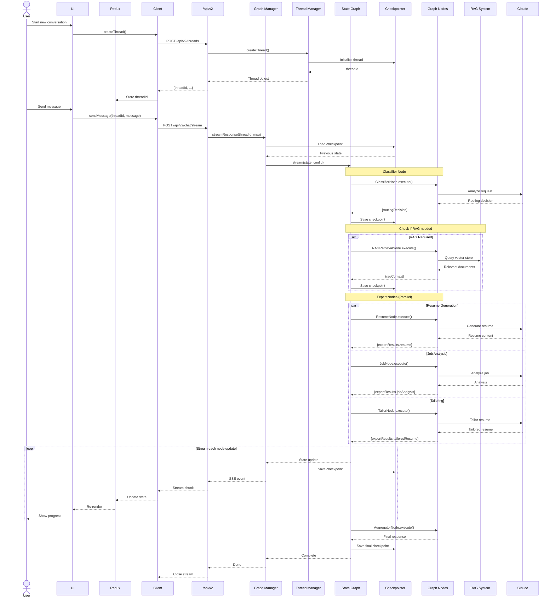
```mermaid
sequenceDiagram
    actor User
    participant UI
    participant Redux
    participant Client
    participant V2API as /api/v2
    participant GraphMgr as Graph Manager
    participant ThreadMgr as Thread Manager
    participant StateGraph as State Graph
    participant Checkpoint as Checkpointer
    participant Nodes as Graph Nodes
    participant RAG as RAG System
    participant Claude

    User->>UI: Start new conversation
    UI->>Client: createThread()
    Client->>V2API: POST /api/v2/threads
    V2API->>ThreadMgr: createThread()
    ThreadMgr->>Checkpoint: Initialize thread
    Checkpoint-->>ThreadMgr: threadId
    ThreadMgr-->>V2API: Thread object
    V2API-->>Client: {threadId, ...}
    Client->>Redux: Store threadId

    User->>UI: Send message
    UI->>Client: sendMessage(threadId, message)
    Client->>V2API: POST /api/v2/chat/stream

    V2API->>GraphMgr: streamResponse(threadId, msg)
    GraphMgr->>Checkpoint: Load checkpoint
    Checkpoint-->>GraphMgr: Previous state

    GraphMgr->>StateGraph: stream(state, config)

    Note over StateGraph,Nodes: Classifier Node
    StateGraph->>Nodes: ClassifierNode.execute()
    Nodes->>Claude: Analyze request
    Claude-->>Nodes: Routing decision
    Nodes-->>StateGraph: {routingDecision}
    StateGraph->>Checkpoint: Save checkpoint

    Note over StateGraph,RAG: Check if RAG needed
    alt RAG Required
        StateGraph->>Nodes: RAGRetrievalNode.execute()
        Nodes->>RAG: Query vector store
        RAG-->>Nodes: Relevant documents
        Nodes-->>StateGraph: {ragContext}
        StateGraph->>Checkpoint: Save checkpoint
    end

    Note over StateGraph,Nodes: Expert Nodes (Parallel)
    par Resume Generation
        StateGraph->>Nodes: ResumeNode.execute()
        Nodes->>Claude: Generate resume
        Claude-->>Nodes: Resume content
        Nodes-->>StateGraph: {expertResults.resume}
    and Job Analysis
        StateGraph->>Nodes: JobNode.execute()
        Nodes->>Claude: Analyze job
        Claude-->>Nodes: Analysis
        Nodes-->>StateGraph: {expertResults.jobAnalysis}
    and Tailoring
        StateGraph->>Nodes: TailorNode.execute()
        Nodes->>Claude: Tailor resume
        Claude-->>Nodes: Tailored resume
        Nodes-->>StateGraph: {expertResults.tailoredResume}
    end

    loop Stream each node update
        StateGraph-->>GraphMgr: State update
        GraphMgr->>Checkpoint: Save checkpoint
        GraphMgr-->>V2API: SSE event
        V2API-->>Client: Stream chunk
        Client-->>Redux: Update state
        Redux-->>UI: Re-render
        UI-->>User: Show progress
    end

    StateGraph->>Nodes: AggregatorNode.execute()
    Nodes-->>StateGraph: Final response
    StateGraph->>Checkpoint: Save final checkpoint
    StateGraph-->>GraphMgr: Complete
    GraphMgr-->>V2API: Done
    V2API-->>Client: Close stream
```

### V2 Graph Node Execution Pattern

```mermaid
graph TB
    subgraph "Node Execution Lifecycle"
        Start([Node Invoked]) --> LoadState[Load Current State]
        LoadState --> Execute[Execute Node Logic]

        Execute --> APICall{Requires<br/>Claude API?}
        APICall -->|Yes| ClaudeRequest[Call Claude AI]
        APICall -->|No| ProcessLocal[Process Locally]

        ClaudeRequest --> UpdateState[Update State]
        ProcessLocal --> UpdateState

        UpdateState --> SaveCheckpoint[Save Checkpoint]
        SaveCheckpoint --> StreamUpdate[Stream Update to Client]
        StreamUpdate --> NextNode{More Nodes?}

        NextNode -->|Yes| DetermineNext[Determine Next Node]
        NextNode -->|No| Complete([Workflow Complete])

        DetermineNext --> Start
    end

    subgraph "Parallel Execution"
        Fork[Fork State] --> NodeA[Node A]
        Fork --> NodeB[Node B]
        Fork --> NodeC[Node C]

        NodeA --> Join[Join Results]
        NodeB --> Join
        NodeC --> Join

        Join --> Aggregate[Aggregate Node]
    end

    style Start fill:#4caf50
    style Complete fill:#f44336
    style Fork fill:#ff9800
    style Join fill:#2196f3
```

### V2 RAG Retrieval Flow

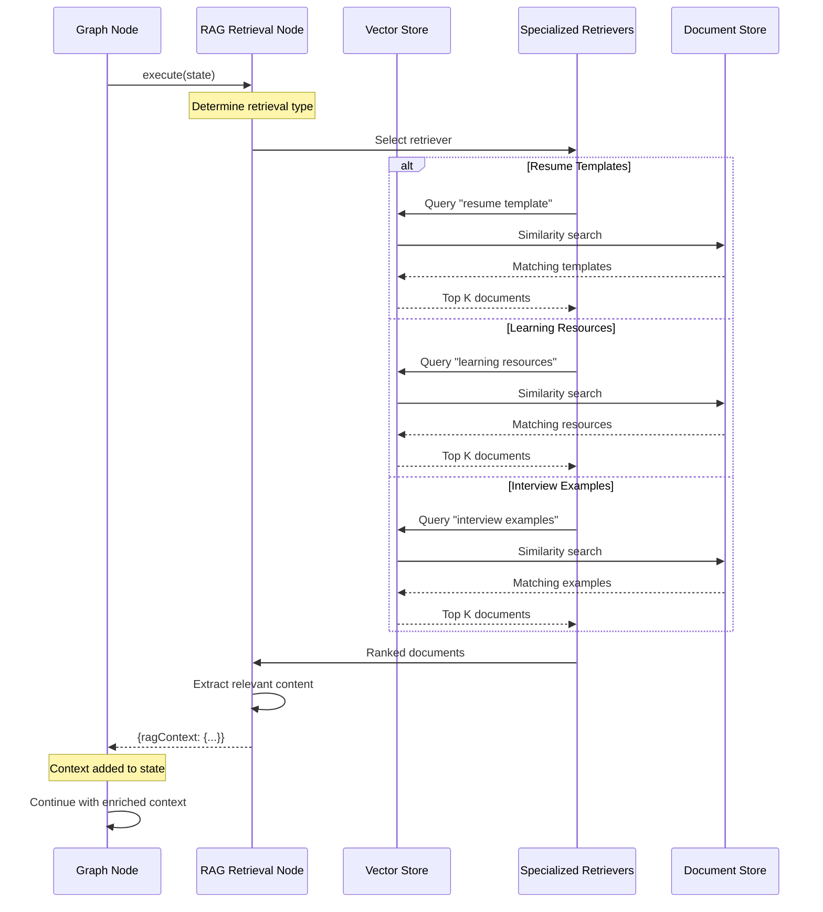
```mermaid
sequenceDiagram
    participant Node as Graph Node
    participant RAGNode as RAG Retrieval Node
    participant VectorStore as Vector Store
    participant Retrievers as Specialized Retrievers
    participant Documents as Document Store

    Node->>RAGNode: execute(state)
    Note over RAGNode: Determine retrieval type

    RAGNode->>Retrievers: Select retriever

    alt Resume Templates
        Retrievers->>VectorStore: Query "resume template"
        VectorStore->>Documents: Similarity search
        Documents-->>VectorStore: Matching templates
        VectorStore-->>Retrievers: Top K documents
    else Learning Resources
        Retrievers->>VectorStore: Query "learning resources"
        VectorStore->>Documents: Similarity search
        Documents-->>VectorStore: Matching resources
        VectorStore-->>Retrievers: Top K documents
    else Interview Examples
        Retrievers->>VectorStore: Query "interview examples"
        VectorStore->>Documents: Similarity search
        Documents-->>VectorStore: Matching examples
        VectorStore-->>Retrievers: Top K documents
    end

    Retrievers->>RAGNode: Ranked documents
    RAGNode->>RAGNode: Extract relevant content
    RAGNode-->>Node: {ragContext: {...}}

    Note over Node: Context added to state
    Node->>Node: Continue with enriched context
```

## Cross-Service Communication

### API Request Flow (with Middleware)

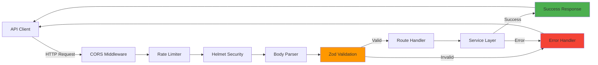
```mermaid
graph LR
    Client[API Client] -->|HTTP Request| CORS[CORS Middleware]
    CORS --> RateLimit[Rate Limiter]
    RateLimit --> Helmet[Helmet Security]
    Helmet --> BodyParser[Body Parser]
    BodyParser --> Validation[Zod Validation]

    Validation -->|Valid| Router[Route Handler]
    Validation -->|Invalid| ErrorHandler[Error Handler]

    Router --> Service[Service Layer]

    Service -->|Success| Response[Success Response]
    Service -->|Error| ErrorHandler

    Response --> Client
    ErrorHandler --> Client

    style Validation fill:#ff9800
    style ErrorHandler fill:#f44336
    style Response fill:#4caf50
```

### V1 vs V2 API Routing

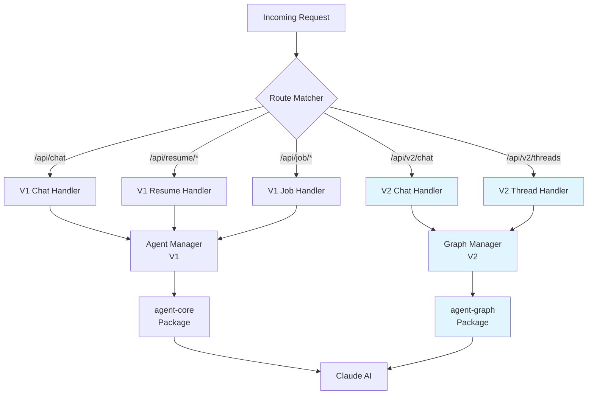
```mermaid
graph TB
    Request[Incoming Request] --> Router{Route Matcher}

    Router -->|/api/chat| V1Chat[V1 Chat Handler]
    Router -->|/api/resume/*| V1Resume[V1 Resume Handler]
    Router -->|/api/job/*| V1Job[V1 Job Handler]
    Router -->|/api/v2/chat| V2Chat[V2 Chat Handler]
    Router -->|/api/v2/threads| V2Threads[V2 Thread Handler]

    V1Chat --> AgentManager[Agent Manager<br/>V1]
    V1Resume --> AgentManager
    V1Job --> AgentManager

    V2Chat --> GraphManager[Graph Manager<br/>V2]
    V2Threads --> GraphManager

    AgentManager --> AgentCore[agent-core<br/>Package]
    GraphManager --> AgentGraph[agent-graph<br/>Package]

    AgentCore --> Claude[Claude AI]
    AgentGraph --> Claude

    style V2Chat fill:#e1f5fe
    style V2Threads fill:#e1f5fe
    style GraphManager fill:#e1f5fe
    style AgentGraph fill:#e1f5fe
```

## State Management

### Redux State Flow (Browser)

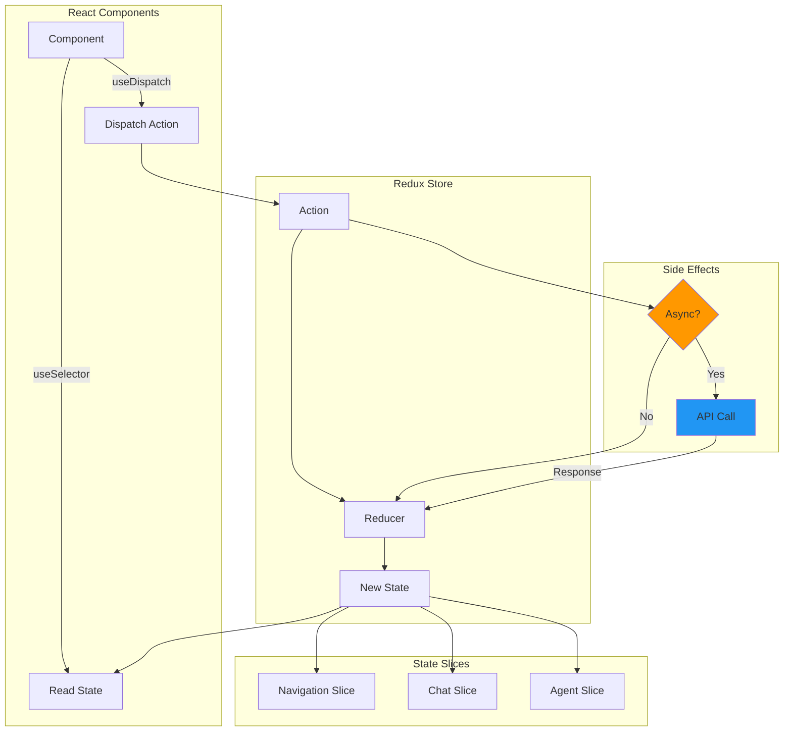
```mermaid
graph TB
    subgraph "React Components"
        Component[Component] -->|useSelector| ReadState[Read State]
        Component -->|useDispatch| DispatchAction[Dispatch Action]
    end

    subgraph "Redux Store"
        DispatchAction --> Action[Action]
        Action --> Reducer[Reducer]
        Reducer --> NewState[New State]
        NewState --> ReadState
    end

    subgraph "State Slices"
        NewState --> NavSlice[Navigation Slice]
        NewState --> ChatSlice[Chat Slice]
        NewState --> AgentSlice[Agent Slice]
    end

    subgraph "Side Effects"
        Action --> Thunk{Async?}
        Thunk -->|Yes| APICall[API Call]
        Thunk -->|No| Reducer
        APICall -->|Response| Reducer
    end

    style Thunk fill:#ff9800
    style APICall fill:#2196f3
```

### LangGraph State Updates (V2)

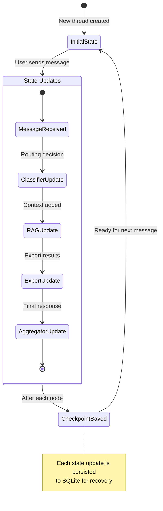
```mermaid
stateDiagram-v2
    [*] --> InitialState: New thread created

    state "State Updates" as Updates {
        [*] --> MessageReceived
        MessageReceived --> ClassifierUpdate: Routing decision
        ClassifierUpdate --> RAGUpdate: Context added
        RAGUpdate --> ExpertUpdate: Expert results
        ExpertUpdate --> AggregatorUpdate: Final response
        AggregatorUpdate --> [*]
    }

    InitialState --> Updates: User sends message
    Updates --> CheckpointSaved: After each node
    CheckpointSaved --> InitialState: Ready for next message

    note right of CheckpointSaved
        Each state update is persisted
        to SQLite for recovery
    end note
```

### State Persistence Architecture

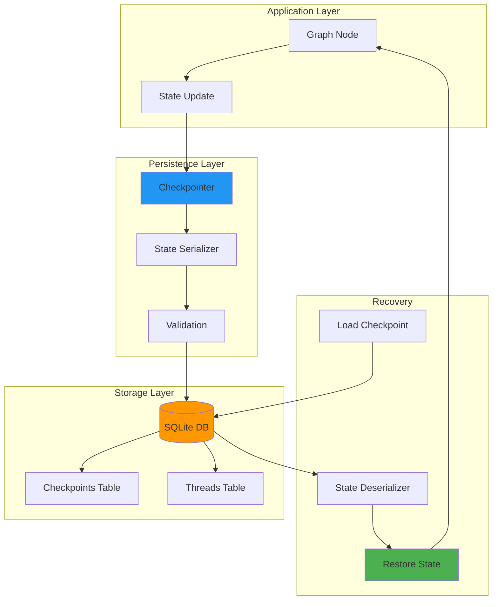
```mermaid
graph TB
    subgraph "Application Layer"
        Node[Graph Node] --> StateUpdate[State Update]
    end

    subgraph "Persistence Layer"
        StateUpdate --> Checkpointer[Checkpointer]
        Checkpointer --> Serializer[State Serializer]
        Serializer --> Validator[Validation]
    end

    subgraph "Storage Layer"
        Validator --> SQLite[(SQLite DB)]
        SQLite --> CheckpointTable[Checkpoints Table]
        SQLite --> ThreadTable[Threads Table]
    end

    subgraph "Recovery"
        LoadCheckpoint[Load Checkpoint] --> SQLite
        SQLite --> Deserializer[State Deserializer]
        Deserializer --> RestoreState[Restore State]
        RestoreState --> Node
    end

    style Checkpointer fill:#2196f3
    style SQLite fill:#ff9800
    style RestoreState fill:#4caf50
```

## Error Handling

### Error Propagation Flow

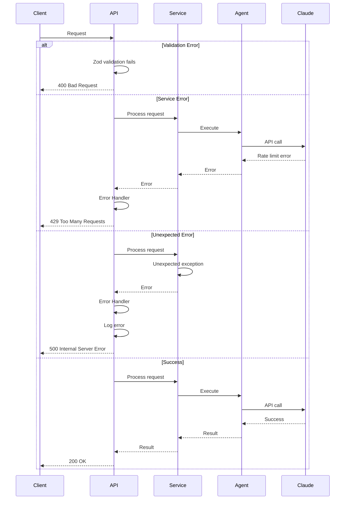
```mermaid
sequenceDiagram
    participant Client
    participant API
    participant Service
    participant Agent
    participant Claude

    Client->>API: Request

    alt Validation Error
        API->>API: Zod validation fails
        API-->>Client: 400 Bad Request
    else Service Error
        API->>Service: Process request
        Service->>Agent: Execute
        Agent->>Claude: API call
        Claude-->>Agent: Rate limit error
        Agent-->>Service: Error
        Service-->>API: Error
        API->>API: Error Handler
        API-->>Client: 429 Too Many Requests
    else Unexpected Error
        API->>Service: Process request
        Service->>Service: Unexpected exception
        Service-->>API: Error
        API->>API: Error Handler
        API->>API: Log error
        API-->>Client: 500 Internal Server Error
    else Success
        API->>Service: Process request
        Service->>Agent: Execute
        Agent->>Claude: API call
        Claude-->>Agent: Success
        Agent-->>Service: Result
        Service-->>API: Result
        API-->>Client: 200 OK
    end
```

### V2 Checkpoint Recovery on Error

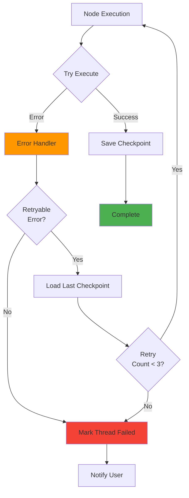
```mermaid
graph TB
    Start[Node Execution] --> Try{Try Execute}
    Try -->|Success| SaveCheckpoint[Save Checkpoint]
    Try -->|Error| ErrorHandler[Error Handler]

    ErrorHandler --> Retryable{Retryable<br/>Error?}
    Retryable -->|Yes| LoadLast[Load Last Checkpoint]
    Retryable -->|No| MarkFailed[Mark Thread Failed]

    LoadLast --> RetryCount{Retry<br/>Count < 3?}
    RetryCount -->|Yes| Start
    RetryCount -->|No| MarkFailed

    SaveCheckpoint --> Complete[Complete]
    MarkFailed --> NotifyUser[Notify User]

    style ErrorHandler fill:#ff9800
    style MarkFailed fill:#f44336
    style Complete fill:#4caf50
```

## Security Flows

### API Key Security (V1 vs V2)

```mermaid
graph TB
    subgraph "V1 Security Model"
        BrowserV1[Browser] -->|API Key in localStorage| RequestV1[HTTP Request]
        RequestV1 -->|Key in request| APIV1[API Server]
        APIV1 -->|Use key| ClaudeV1[Claude AI]
    end

    subgraph "V2 Security Model"
        BrowserV2[Browser] -->|No API key| RequestV2[HTTP Request]
        RequestV2 -->|Session/Auth token| APIV2[API Server]
        APIV2 -->|Load key from env.json| Config[Configuration]
        Config -->|Secure key| ClaudeV2[Claude AI]
    end

    style BrowserV1 fill:#ffebee
    style BrowserV2 fill:#e8f5e9
```

### Authentication Flow (Future)

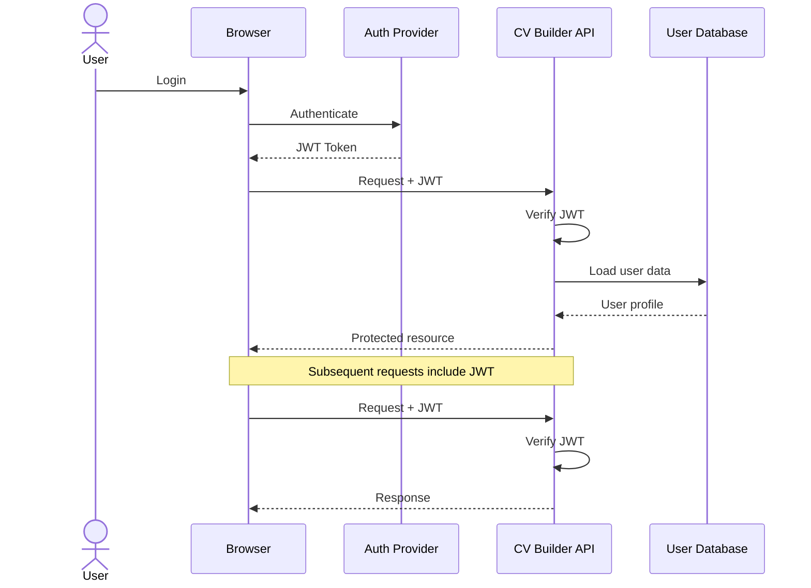
```mermaid
sequenceDiagram
    actor User
    participant Browser
    participant Auth as Auth Provider
    participant API as CV Builder API
    participant DB as User Database

    User->>Browser: Login
    Browser->>Auth: Authenticate
    Auth-->>Browser: JWT Token

    Browser->>API: Request + JWT
    API->>API: Verify JWT
    API->>DB: Load user data
    DB-->>API: User profile
    API-->>Browser: Protected resource

    Note over Browser,API: Subsequent requests include JWT
    Browser->>API: Request + JWT
    API->>API: Verify JWT
    API-->>Browser: Response
```

### Rate Limiting Flow

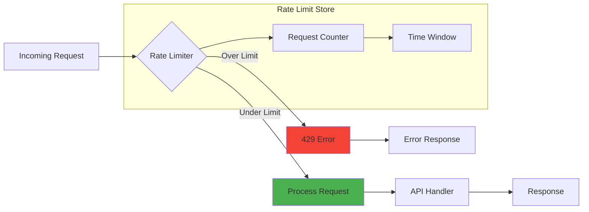
```mermaid
graph LR
    Request[Incoming Request] --> RateLimit{Rate Limiter}

    RateLimit -->|Under Limit| Allowed[Process Request]
    RateLimit -->|Over Limit| Blocked[429 Error]

    Allowed --> API[API Handler]
    API --> Response[Response]

    Blocked --> ErrorResponse[Error Response]

    subgraph "Rate Limit Store"
        RateLimit --> Counter[Request Counter]
        Counter --> TTL[Time Window]
    end

    style Blocked fill:#f44336
    style Allowed fill:#4caf50
```

## Performance Optimization

### V2 Parallel Execution

```mermaid
gantt
    title Node Execution Comparison
    dateFormat X
    axisFormat %L ms

    section V1 Sequential
    Classifier :0, 100
    Resume :100, 800
    Job Analysis :900, 600
    Tailoring :1500, 500
    Skills Gap :2000, 400
    Interview :2400, 500
    Total V1 :2900, 1

    section V2 Parallel
    Classifier :0, 100
    Resume (parallel) :100, 800
    Job (parallel) :100, 600
    Tailoring (parallel) :100, 500
    Skills (parallel) :100, 400
    Interview (parallel) :100, 500
    Aggregator :900, 100
    Total V2 :1000, 1
```

### Caching Strategy

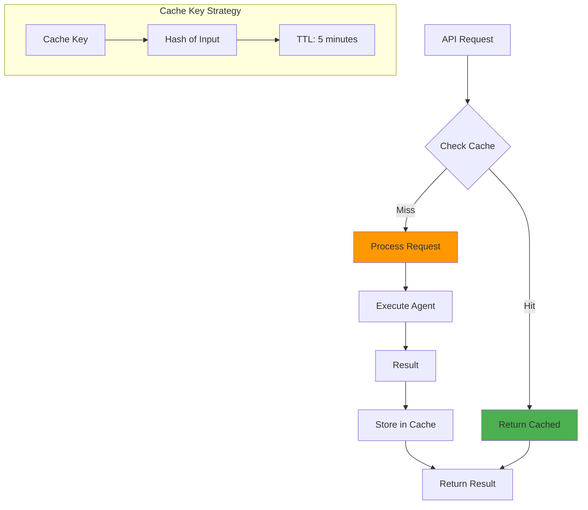
```mermaid
graph TB
    Request[API Request] --> Cache{Check Cache}

    Cache -->|Hit| CacheHit[Return Cached]
    Cache -->|Miss| Process[Process Request]

    Process --> Agent[Execute Agent]
    Agent --> Result[Result]

    Result --> Store[Store in Cache]
    Store --> Return[Return Result]

    CacheHit --> Return

    subgraph "Cache Key Strategy"
        CacheKey[Cache Key] --> Hash[Hash of Input]
        Hash --> TTL[TTL: 5 minutes]
    end

    style CacheHit fill:#4caf50
    style Process fill:#ff9800
```

## Summary

This document provides comprehensive service interaction diagrams for the CV Builder application. Key takeaways:

### V1 Architecture
- Simple request-response pattern
- Sequential agent execution
- No state persistence
- Direct API calls from agents

### V2 Architecture
- Thread-based conversations
- Parallel expert execution
- State checkpointing and recovery
- RAG-enhanced responses
- Advanced error handling

### Migration Path
- V1 and V2 coexist via feature flags
- V2 provides backwards-compatible API
- Gradual migration of features
- Full feature parity expected by Q2 2025

---

**Last Updated**: 2025-12-04
**Version**: 2.0.0
**Maintainer**: CV Builder Team
