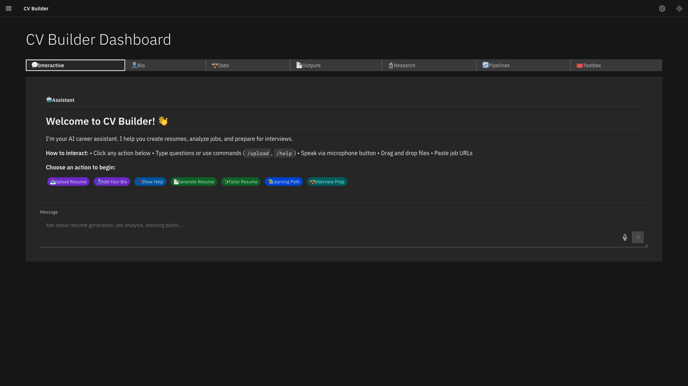
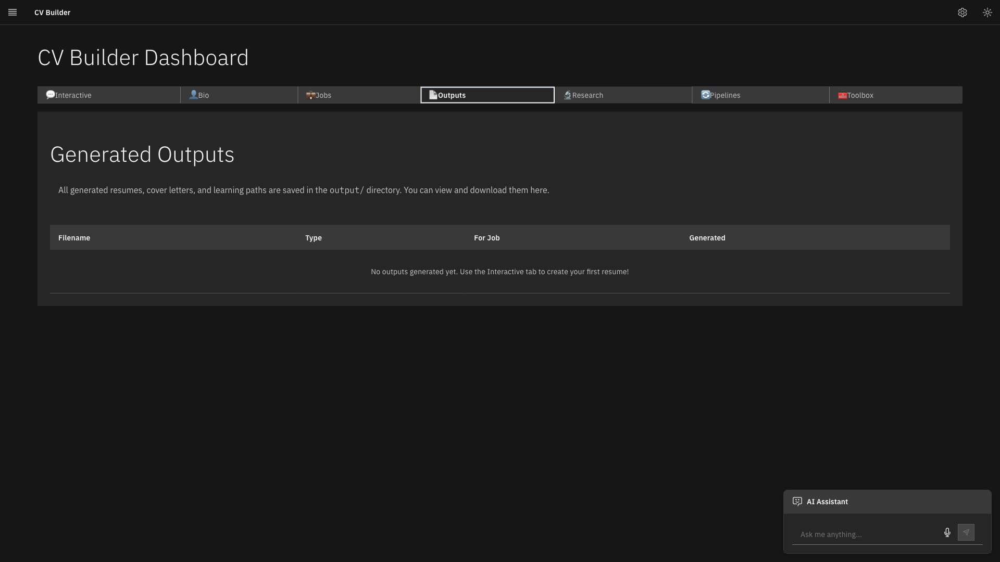
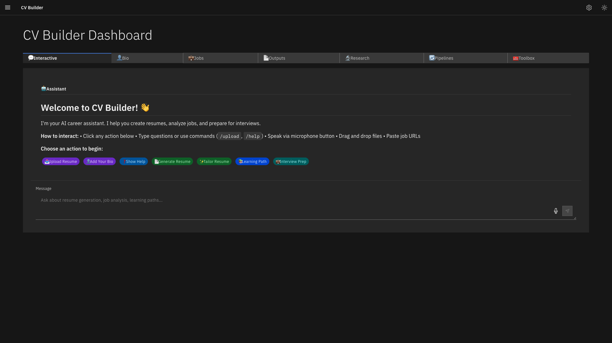

# Cv Builder - Screenshot Documentation

**Source:** PR #36
**Date:** 2025-11-17
**Total Screenshots:** 15

## Test Suites

### Bio Form

**Screenshots:** 1

#### Navigate Tabs Bio

**File:** `bio-form/navigate-tabs-bio.png`

---

### Chat

**Screenshots:** 2

#### Engage Empty Input

**File:** `chat/engage-empty-input.png`

---

#### Engage With Text

**File:** `chat/engage-with-text.png`

---

### Interactive

**Screenshots:** 1

#### Navigate Tabs Interactive

**File:** `interactive/navigate-tabs-interactive.png`

---

### Jobs

**Screenshots:** 1

#### Navigate Tabs Jobs

**File:** `jobs/navigate-tabs-jobs.png`

---

### Outputs

**Screenshots:** 1

#### Navigate Tabs Outputs

**File:** `outputs/navigate-tabs-outputs.png`

---

### Settings

**Screenshots:** 3

#### Open Closed

**File:** `settings/open-closed.png`

---

#### Open Modal

**File:** `settings/open-modal.png`

---

#### Open Status

**File:** `settings/open-status.png`

---

### Sidebar

**Screenshots:** 3

#### Toggle Collapsed Again

**File:** `sidebar/toggle-collapsed-again.png`

---

#### Toggle Collapsed

**File:** `sidebar/toggle-collapsed.png`

---

#### Toggle Expanded

**File:** `sidebar/toggle-expanded.png`

---

### Theme

**Screenshots:** 3

#### Switch Dark

**File:** `theme/switch-dark.png`

---

#### Switch Initial Dark

**File:** `theme/switch-initial-dark.png`

---

#### Switch Light

**File:** `theme/switch-light.png`

---

## Update History

- **2025-11-17** - Initial documentation from PR #36
